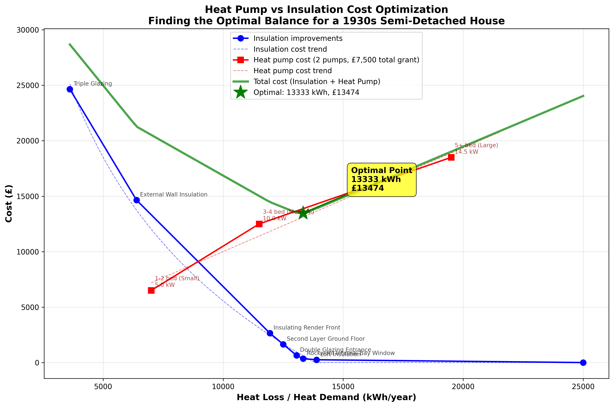
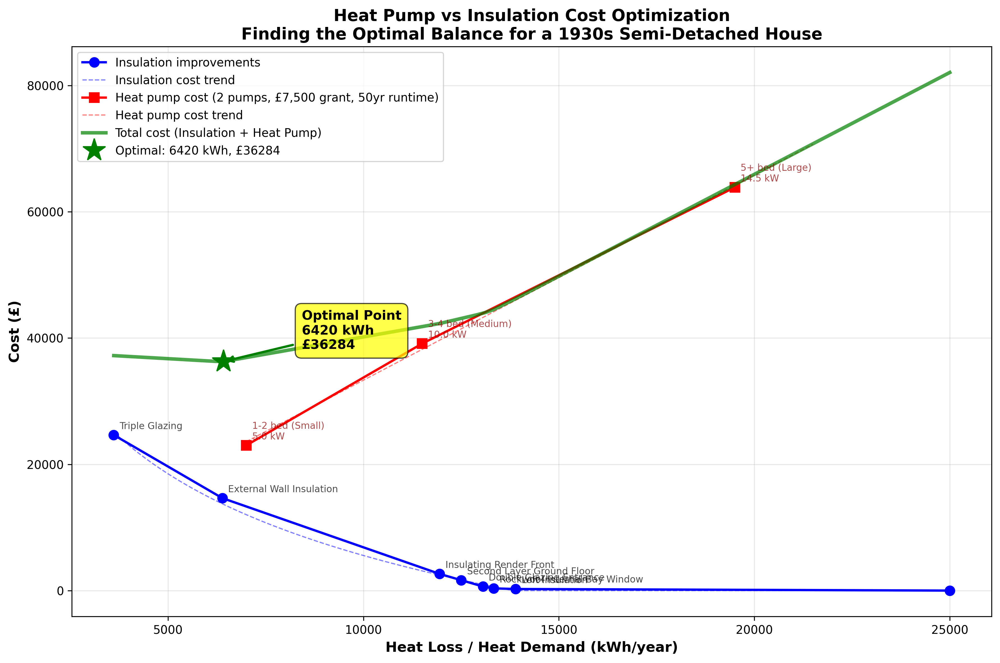

# Fabric First vs Heat Pump First

## Introduction

Heat-pumps for the domestic market are seen as an important effort towards the electrification of our economy and as such as a contribution for the reduction of greenhouse gases such as CO2, the net zero target. Yet, there seems to be a divide between those who think that any government policy should address the shortcomings in the UK housing stock first, i.e. insulating the building fabric of all dwellings. Others might think that adopting heat-pumps first is the most important factor, and heat-loss can be improved later. It is a matter where money should go.

The objective of this article is to present some numbers for an optimised compromisation of the total cost: combine a minimum amount of insulation with the smallest heat pump one can get away with.

## Analysis Scenario

We consider a 1930s semi-detached house, approximately 80m², in its original shape with:
- Solid brick walls
- Basic double glazing
- No loft insulation

The estimated heat loss over an entire year for our house was estimated to be approximately **25,000 kWh** without any insulation (at the time of purchase). The estimated heat loss at standard conditions (21°C inside, 2°C outside) was also estimated to be **9,000 W**. This gives us an empirical conversion factor of approximately **2.78** for converting design heat loss (in Watts) to annual heating energy (in kWh/year), accounting for actual weather patterns and heating usage throughout the year.

### Heat Pump Options

The analysis considers three heat pump sizes suitable for different property types:

| Capacity (kW) | Property Type | Heat Demand (kWh/year) | Electricity Use (kWh/year) | Cost (£) |
|---------------|---------------|------------------------|----------------------------|----------|
| 5.0 | 1-2 bed (Small) | 7,000 | 2,200 | £7,000 |
| 10.0 | 3-4 bed (Medium) | 11,500 | 3,550 | £10,000 |
| 14.5 | 5+ bed (Large) | 19,500 | 6,050 | £13,000 |

### Home Improvement Options

The following insulation improvements are considered, sorted by cost-effectiveness (Watts of heat reduction per pound spent). The heat loss reductions are given at design conditions (21°C inside, 2°C outside) and converted to annual energy savings using the empirical factor:

| Improvement | Cost (£) | Heat Loss Reduction (W) | Annual Energy Saving (kWh/year) | Cost-Effectiveness (W/£) |
|-------------|----------|------------------------|--------------------------------|------------------------|
| Loft insulation | £250 | 4,000 | 11,111 | 16.0 |
| Rockwool internal bay window | £100 | 200 | 556 | 2.0 |
| Double glazing entrance | £300 | 100 | 278 | 0.33 |
| Second layer ground floor | £1,000 | 200 | 556 | 0.20 |
| Insulating render front | £1,000 | 200 | 556 | 0.20 |
| External wall insulation | £12,000 | 2,000 | 5,556 | 0.17 |
| Triple glazing | £10,000 | 1,000 | 2,778 | 0.10 |

Improvements are applied in order of cost-effectiveness, ensuring the most efficient measures are implemented first. The total cost is cummulative.

### Analysis Scenarios

Three different scenarios are examined with respect to capital expenditure:

1. **No Grant**: Single heat pump installation without government support
2. **With £7,500 Grant**: Single heat pump with the UK government's Boiler Upgrade Scheme grant
3. **50-Year Lifecycle**: Two heat pump replacements over 50 years (first with grant, second without)

for two cases, first, with capital expenditure only, and second, with both capital and operational expenditure.

## Capital Expenditure Only

When considering only the upfront capital costs of installation, the analysis reveals a consistent optimal strategy across all three scenarios.

### Scenario 1: No Government Grant

Without any government support, the optimal approach requires a total capital investment of **£10,662**. This consists of:
- **£350** for insulation (loft insulation + rockwool bay window, reducing heat loss from 25,000 to 13,333 kWh/year)
- **£10,312** for a single heat pump installation

The analysis shows that implementing the two most cost-effective improvements combined with a moderately-sized heat pump represents the most cost-effective solution when considering capital costs alone.

### Scenario 2: With £7,500 Government Grant

The UK's Boiler Upgrade Scheme provides a £7,500 grant towards heat pump installation. With this support, the total capital cost reduces to **£3,162**:
- **£350** for insulation
- **£2,812** for heat pump (after £7,500 grant deduction)

Importantly, the optimal heat loss target remains unchanged at 13,333 kWh/year. The grant provides substantial financial relief but does not alter the optimal balance between insulation and heat pump capacity.

### Scenario 3: 50-Year Lifecycle (Two Heat Pumps)

Over a 50-year period, heat pumps typically need replacement after 20-25 years. This scenario accounts for two heat pump purchases:
- First heat pump with £7,500 grant
- Second heat pump at full cost (no grant)

Total 50-year capital expenditure: **£13,474**
- **£350** for insulation (one-time investment lasting 50 years)
- **£13,124** for two heat pumps (net of one £7,500 grant)

Even with the grant on the first unit, the 50-year capital cost exceeds the no-grant single-pump scenario, highlighting the importance of heat pump longevity and replacement costs.

### Key Insight: Capital Costs Only

When considering capital costs alone, the optimal strategy in all three scenarios is identical: invest £350 in the two most cost-effective improvements (loft insulation and bay window insulation) to reduce heat loss to 13,333 kWh/year. The government grant provides significant immediate cost relief (£7,500 savings), but this benefit is partially offset by the second heat pump replacement cost over a 50-year timeframe.

## Capital and Operational Expenditure

The analysis changes dramatically when operational costs—specifically electricity consumption—are included over the lifetime of the system. For this analysis, we assume an electricity rate of **£0.15/kWh** (15p per kilowatt-hour), which represents a typical domestic electricity tariff in the UK for people running a heat-pump (and make use of some  dynamic tarrifs such as Octopus Cozy). This operational cost assumption significantly impacts the long-term economic case for different insulation levels.

### Scenario 1: No Grant + 25 Years Runtime

Including 25 years of electricity costs at £0.15/kWh transforms the cost picture:

**Total lifecycle cost: £26,059**
- Capital costs: £11,453
- Runtime costs: **£15,021** (57.7% of total)

The runtime costs now exceed the initial capital investment, demonstrating that operational expenses dominate long-term costs. The optimal heat loss shifts slightly to 12,901 kWh/year (requiring £928 in insulation). Annual electricity consumption at this optimal point is 4,006 kWh, costing £601 per year.

### Scenario 2: With Grant + 25 Years Runtime

With the £7,500 grant and 25 years of operation:

**Total lifecycle cost: £18,559**
- Capital costs: £3,953
- Runtime costs: **£15,021** (80.9% of total)

The grant dramatically reduces capital costs, but runtime costs remain unchanged. Runtime expenses now constitute an overwhelming 81% of total lifecycle costs, emphasizing that the grant primarily addresses the upfront barrier rather than long-term economics.

### Scenario 3: 50-Year Lifecycle + Runtime

The 50-year analysis with operational costs reveals a crucial finding:

**Total lifecycle cost: £36,284**
- Capital costs: £21,083
- Runtime costs: **£15,201** (41.9% of total)

**Critical Discovery**: The optimal heat loss target shifts dramatically from 13,333 kWh/year to **6,420 kWh/year**. This means investing approximately **£14,583 in insulation** becomes economically justified—a massive increase from the £350 optimal for capital-only scenarios.

Why? Over 50 years, the cumulative electricity savings from comprehensive insulation (reducing annual consumption from 4,006 kWh to 2,006 kWh) outweigh the higher upfront insulation costs. The additional £14,233 insulation investment saves approximately 2,000 kWh annually × 50 years × £0.15/kWh = £15,000 in electricity, more than paying for itself.

## Conclusion

The "fabric first vs heat pump first" debate has no single answer—it depends critically on time horizon and whether operational costs are included. Runtime costs represent 42-81% of total lifecycle costs, fundamentally changing the optimization equation. When focusing solely on capital costs, minimal insulation (£350) combined with a heat pump is optimal. However, when operational costs are considered over 50 years, optimal insulation spending increases **42-fold** to £14,583, reducing heat loss from 13,333 to 6,420 kWh/year—"Fabric First" becomes economically dominant for long-term ownership.

Current policy, while effectively addressing upfront cost barriers through £7,500 heat pump grants, may inadvertently discourage optimal long-term investment in building fabric. A more balanced approach—split incentives covering both insulation and heat pumps, lifecycle cost education, and tiered grants for comprehensive improvements—would better align short-term decisions with long-term economic and environmental objectives.

---

*Analysis based on: 1930s semi-detached house (80m²), Cambridge climate, 25,000 kWh/year initial heat loss (9,000 W design heat loss), £0.15/kWh electricity rate, £7,500 government grant (UK Boiler Upgrade Scheme). Home improvements sorted by cost-effectiveness (W/£).*
