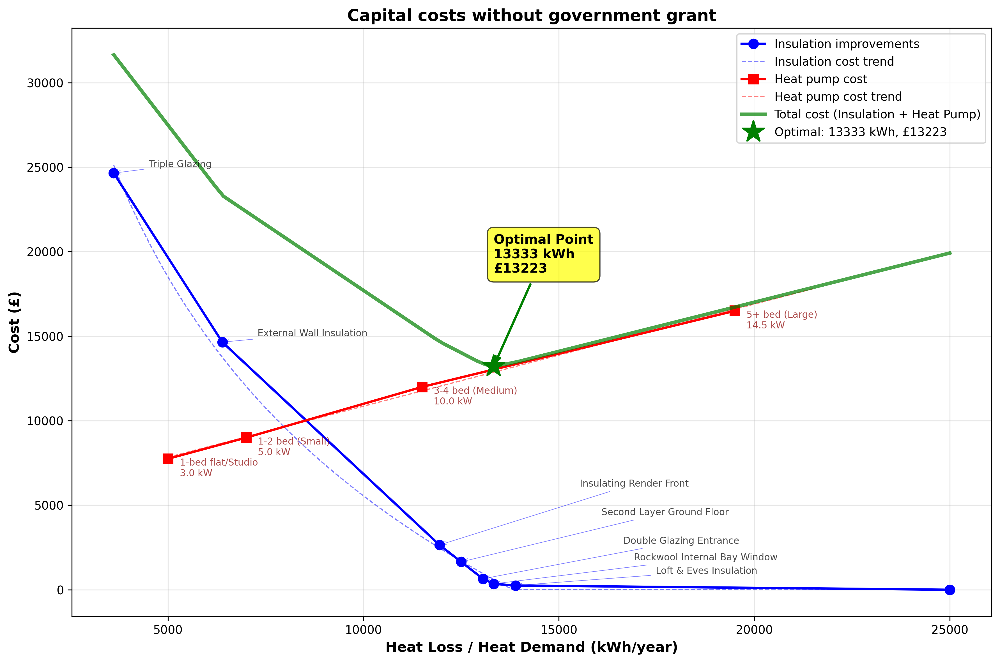
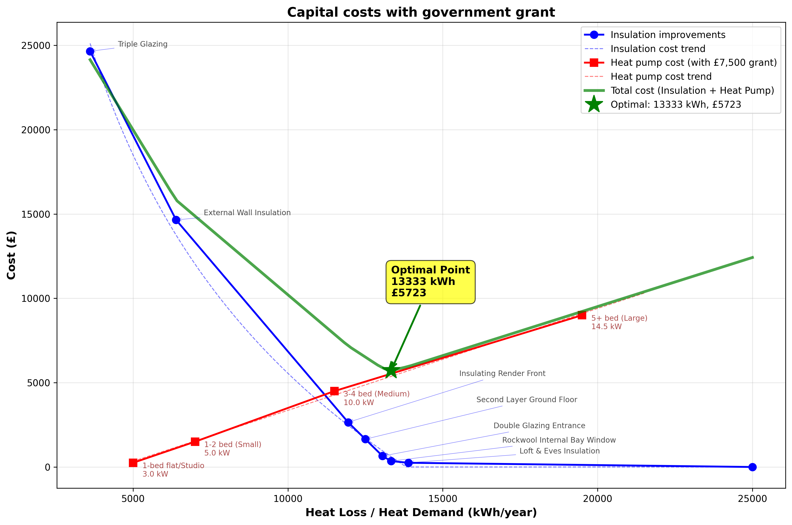
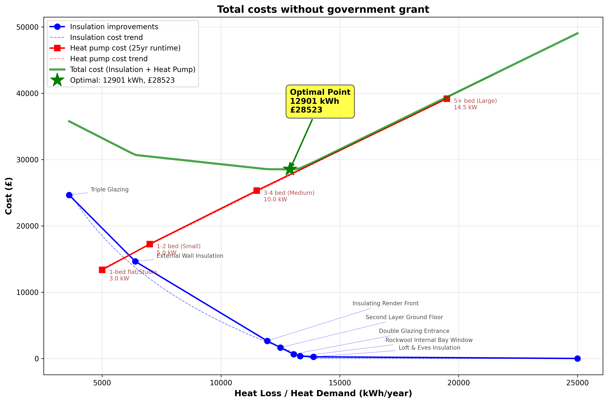
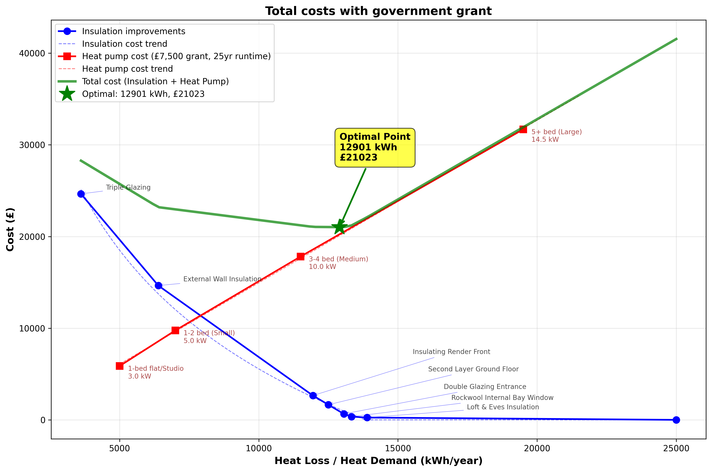

# Findings in the Fabric First vs Heat Pump First Debate

## Introduction

Heat-pumps for homes are seen as an important effort towards the electrification of the economy and as such as a contribution to the reduction of greenhouse gases in the combat against climate change. Yet, there seems to be a divide between those who think that any government policy should address the shortcomings in the poorly insulated housing stock first, i.e. insulating the building fabric, e.g. [Insulate Britain](https://insulatebritain.com/). Others think that adopting heat-pumps is the most important factor, e.g. through the [Boiler Upgrade Scheme](https://www.gov.uk/apply-boiler-upgrade-scheme). In order to understand the debate I have been reading a few books on the subject of heat pumps. Among others, ["So You're Thinking About a Heat Pump: The UK Homeowner's Guide to Heat Pumps"](https://www.amazon.co.uk/Youre-Thinking-About-Heat-Pump/dp/B0GK7H511K/) was actually quite helpful as it addressed the Fabric First vs Heat Pump First debate quite concisely and in a balanced manner, albeit qualitatively only. The objective of this article is to present some quantitative analysis using estimated heat pump installation and home insulation costs in order to determine an optimal outcome.

## Analysis Scenario

The background to this analysis is my experience in [Improving the Thermal Performance of UK 1930s Semi Detached Houses](https://peter-wurmsdobler.medium.com/improving-the-thermal-performance-of-uk-1930s-semi-detached-houses-6f64c6514565), the account for a series of improvements made to a 1930s semi-detached house, approximately 80m², in its original shape with:
- Solid brick walls and walls in the bay area only 10cm thick,
- Basic double glazing mosty and single glazing for entrance area,
- Minimal loft insulation (50mm) and no insulation in eyes.

Over an entire year the worst case heat loss for our house was initally estimated to be approximately **25,000 kWh**, the heat loss at standard conditions (21°C inside, 2°C outside) was also estimated to be **9,000 W**. This gives us an empirical conversion factor of approximately **2.78** for converting design heat loss (in Watts) to annual heating energy (in kWh/year), accounting for weather patterns and heating usage throughout the year.

### Heat Pump Options

The analysis considers four heat pump sizes suitable for different property types (costs are midpoint estimates from industry data):

| Capacity (kW) | Property Type | Heat Demand (kWh/year) | Electricity Use (kWh/year) | Cost (£) |
|---------------|---------------|------------------------|----------------------------|----------|
| 3.0 | 1-bed flat/Studio | 5,000 | 1,500 | £7,750 |
| 5.0 | 1-2 bed (Small) | 7,000 | 2,200 | £9,000 |
| 10.0 | 3-4 bed (Medium) | 11,500 | 3,550 | £12,000 |
| 14.5 | 5+ bed (Large) | 19,500 | 6,050 | £16,500 |

### Home Improvement Options

The following insulation improvements have partially been carried out, or for the last two have been considered; they are sorted by cost-effectiveness (Watts of heat reduction per £ spent). The heat loss reductions are given at design conditions (21°C inside, 2°C outside) and converted to annual energy savings using the empirical factor:

| Improvement | Cost (£) | Heat Loss Reduction (W) | Annual Energy Saving (kWh/year) | Cost-Effectiveness (W/£) |
|-------------|----------|------------------------|--------------------------------|------------------------|
| Loft & eves insulation | £250 | 4,000 | 11,111 | 16.0 |
| Rockwool internal bay window | £100 | 200 | 556 | 2.0 |
| Double glazing entrance | £300 | 100 | 278 | 0.33 |
| Second layer ground floor | £1,000 | 200 | 556 | 0.20 |
| Insulating render front | £1,000 | 200 | 556 | 0.20 |
| External wall insulation | £12,000 | 2,000 | 5,556 | 0.17 |
| Triple glazing | £10,000 | 1,000 | 2,778 | 0.10 |

### Analysis Scenarios

Improvements are applied in order of cost-effectiveness, ensuring the most efficient measures are implemented first. The total cost for fabric improvment is cummulative, starting in essence with doling nothing. Two different scenarios are examined with respect to capital expenditure for a 25-year lifetime:

1. **No Grant**: Single heat pump installation without government support,
2. **With £7,500 Grant**: Single heat pump with the UK government's Boiler Upgrade Scheme grant.

Both scenarios are analysed in two cases: first, with capital expenditure only, and second, with both capital and operational expenditure over a 25-year lifetime, too.

## Capital Expenditure Only

When considering only the upfront capital costs of installation, the analysis reveals a consistent optimal strategy across both scenarios.

### Scenario 1: No Government Grant

Without any government support, the optimal approach requires a total capital investment of **£13,223**. This consists of:
- **£350** for insulation (loft insulation + rockwool bay window, reducing heat loss from 25,000 to 13,333 kWh/year)
- **£12,873** for a single heat pump installation

The analysis shows that implementing the two most cost-effective improvements combined with a moderately-sized heat pump represents the most cost-effective solution when considering capital costs alone.

### Scenario 2: With £7,500 Government Grant

The UK's Boiler Upgrade Scheme provides a £7,500 grant towards heat pump installation. With this support, the total capital cost reduces to **£5,723**:
- **£350** for insulation
- **£5,373** for heat pump (after £7,500 grant deduction)

Importantly, the optimal heat loss target remains unchanged at 13,333 kWh/year. The grant provides substantial financial relief but does not alter the optimal balance between insulation and heat pump capacity.

### Key Insight: Capital Costs Only

When considering capital costs alone, the optimal strategy in both scenarios is identical: invest £350 in the two most cost-effective improvements (loft insulation and bay window insulation) to reduce heat loss to 13,333 kWh/year. The government grant provides significant immediate cost relief (£7,500 savings), making heat pumps more accessible without changing the underlying optimisation.

## Capital and Operational Expenditure

The analysis changes dramatically when operational costs—specifically electricity consumption—are included over the 25-year lifetime of the system. For this analysis, we assume an electricity rate of **£0.15/kWh** (15p per kilowatt-hour), which represents a typical domestic electricity tariff in the UK for people running a heat-pump (and make use of some dynamic tariffs such as Octopus Cosy). This operational cost assumption significantly impacts the long-term economic case for different insulation levels.

### Scenario 1: No Government Grant

Including 25 years of electricity costs at £0.15/kWh transforms the cost picture:

**Total lifecycle cost: £28,523**
- Capital costs: £13,540
- Runtime costs: **£14,983** (52.5% of total)

The runtime costs now approach the capital investment, demonstrating that operational expenses significantly impact long-term economics. The optimal heat loss shifts slightly to 12,901 kWh/year (requiring £928 in insulation). Annual electricity consumption at this optimal point is 3,995 kWh, costing £599 per year.

### Scenario 2: With £7,500 Government Grant

With the £7,500 grant and 25 years of operation:

**Total lifecycle cost: £21,023**
- Capital costs: £6,040
- Runtime costs: **£14,983** (71.3% of total)

The grant dramatically reduces capital costs, but runtime costs remain unchanged. Runtime expenses now constitute an overwhelming 71% of total lifecycle costs, emphasizing that the grant primarily addresses the upfront barrier rather than long-term economics.

## Conclusion

The "fabric first vs heat pump first" debate has no single answer, it depends critically on whether operational costs are included. Runtime costs represent 52-71% of total lifecycle costs over 25 years, fundamentally changing the optimisation equation. When focusing solely on capital costs, minimal insulation (£350) combined with a heat pump is optimal. However, when operational costs are considered over a 25-year lifetime, the optimal insulation increases to £928 (still not prohibitive), reducing heat loss from 13,333 to 12,901 kWh/year. However, no excessive measures such as external wall insulation or tripple glazing is needed.

The shift towards "Fabric First" becomes more pronounced with longer time horizons and higher electricity rates. Current policy, while effectively addressing upfront cost barriers through £7,500 heat pump grants, may inadvertently discourage optimal long-term investment in building fabric. A more balanced approach (split incentives covering both insulation and heat pumps, lifecycle cost education, and tiered grants for comprehensive improvements) would better align short-term decisions with long-term economic and environmental objectives.

For a 25-year ownership horizon, the analysis suggests a pragmatic middle ground: implement the most cost-effective insulation measures (loft, bay windows, and selective improvements) rather than either extreme of "fabric only" or "heat pump only" approaches.

