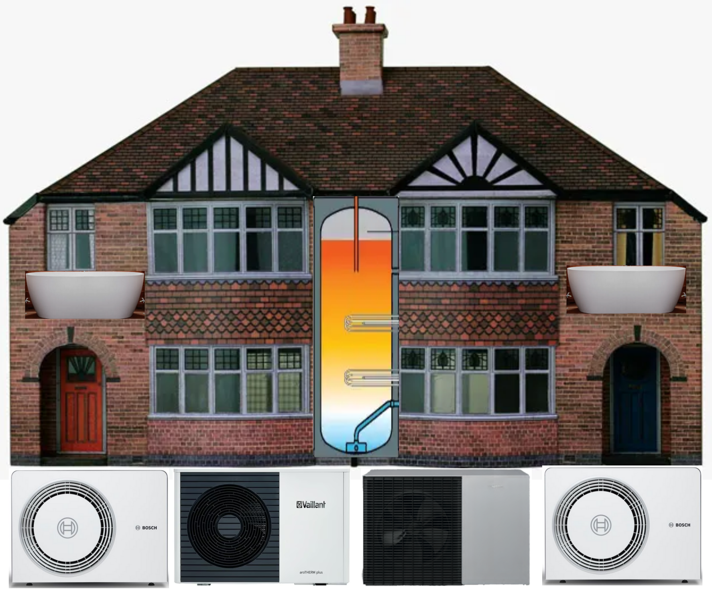
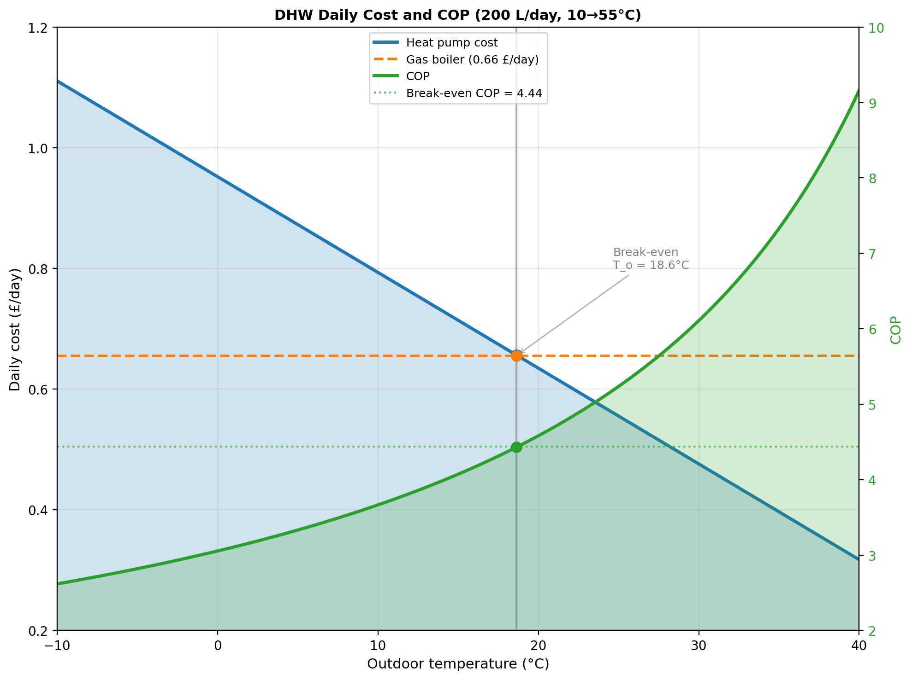
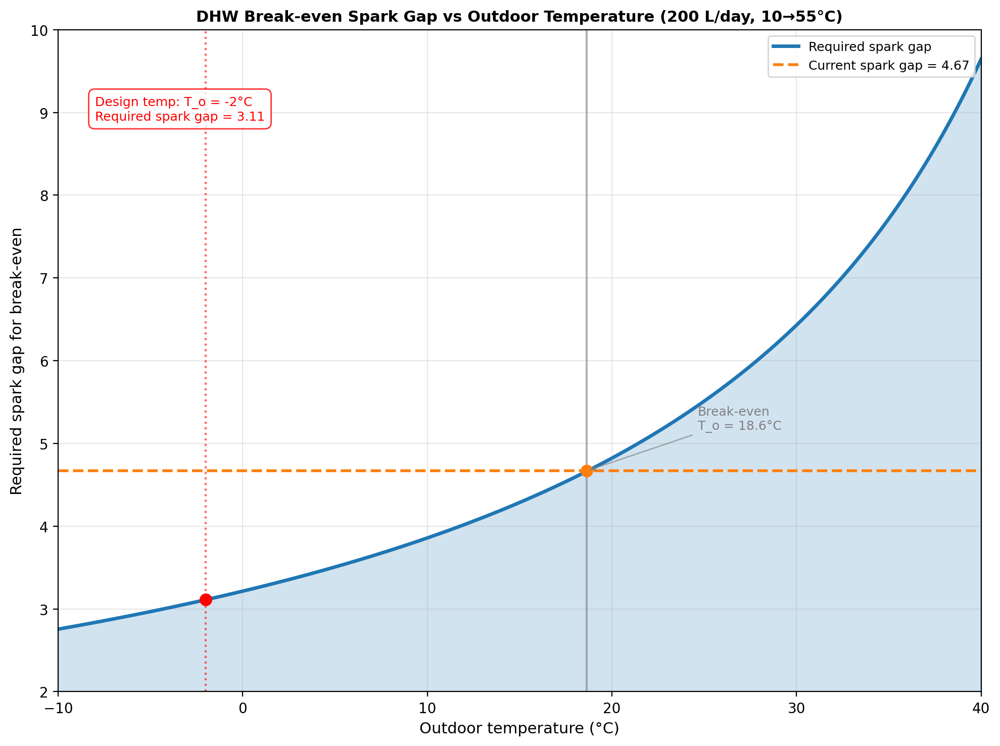
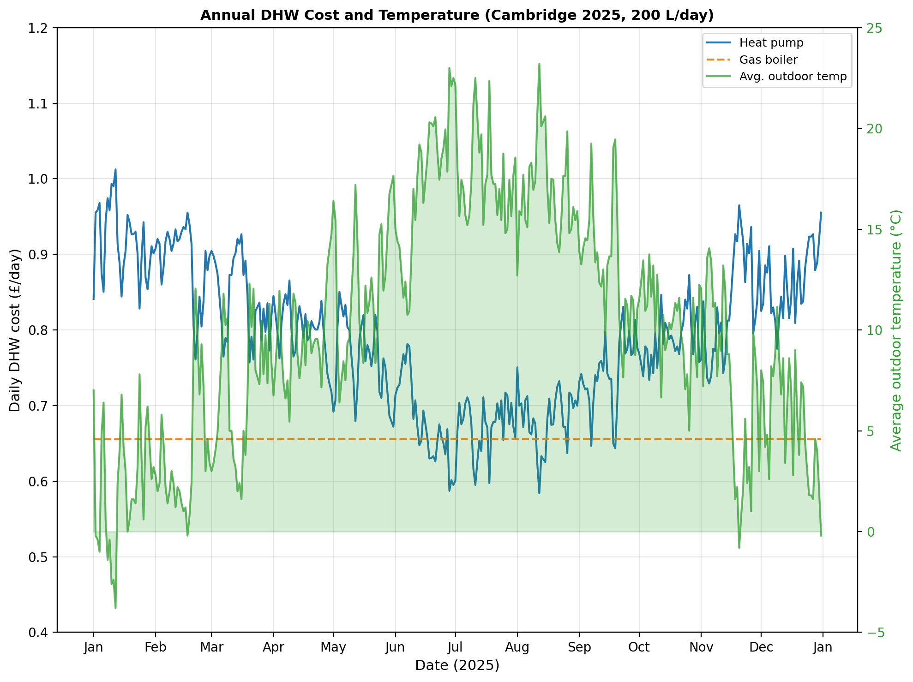

# Quantitative Analysis of Heat Pump Operation for Domestic Hot Water

The preceding story, [Quantitative Analysis of Dynamic Heat Pump Operation for Design Temperature](https://medium.com/@peter-wurmsdobler/quantitative-analysis-of-dynamic-heat-pump-operation-for-design-temperature-51df19846000), looks at the heat pump operation for a design temperature of −2°C; it already sets aside some time during the day needed for domestic hot water (DHW) preparation using the same heat pump. This story focuses on the DHW aspect only, assessing the economics of using a heat pump for domestic hot water production in a system where the same heat pump serves both space heating and DHW needs.

*Figure: Domestic hot water using a heat pump and a hot water tank.*
## DHW Baseline

Heat pumps, like gas boilers, have to be rated for both space heating at a design temperature and DHW at an expected daily use. Two independent approaches support the DHW estimate used here. First, it is assumed that energy for DHW stays mostly the same throughout the year and that its amount determines the energy consumption in summer; for instance, during summer 2025 our gas usage was about 12.5 kWh per day on average, enough energy to heat up 227 l of water from about 10°C to 55°C at a 95% boiler efficiency. Second, an average shower takes about 8 minutes which consumes about 50 l of hot water at a flow rate of 6 l/min in our house. Three people in the household would then result in 150 l; some additional hot water in the kitchen and other usages would bring the total easily to about 200 l/day, a number that sounds plausible and will be used throughout this analysis.

If 200 l of hot water had to be produced at the current flow rate of 6 l/min, a powerful heat pump would be required given the thermal capacity of water (4.18 kJ/kg/K); the heating power would be of the order of 20–30 kW which is similar to a gas combination boiler or our current boiler (^1). Alternatively, a hot water tank is needed as a buffer that is heated gradually when time and cost permit, in particular during periods when space heating is not required. For instance, heating 200 l/day of water from 10°C to 55°C requires 10.5 kWh of thermal energy; at a heat pump power rating of 6 kW, this requires about 1.75 hours for hot water generation during which period the heat pump is not available for space heating. 

## Daily Cost of DHW

The daily cost of heating up 200 l of water from 10°C to 55°C (10.5 kWh) using a gas boiler at 95% efficiency (11.05 kWh) would be 65.5p at 5.93p/kWh (^2). The cost of heating the same amount of water using a heat pump depends on the COP which in turn depends on the flow temperature (55°C for DHW) and the outdoor temperature. The following plot shows both the COP and the daily cost of 200 l hot water for a heat pump at standard energy costs (^2). The heat pump breaks even with gas at an outdoor temperature of approximately 18.6°C, corresponding to a COP of 4.44.

*Figure: Cost of hot water (left axis, blue) and COP (right axis, green) as a function of outdoor temperature at standard energy costs (^2).*

The break-even condition reveals an interesting relationship: the required spark gap as a function of outdoor temperature to make a heat pump economically viable. At the current UK spark gap of 4.67, heat pump DHW becomes economical above 18.6°C. However, even at the Cambridge design temperature of −2°C, where the COP is only 2.96, a spark gap of just 3.11 would be sufficient for the heat pump to break even with gas (calculated as COP / boiler efficiency = 2.96 / 0.95 = 3.11). 

*Figure: Required spark gap for DHW break-even as a function of outdoor temperature. The current UK spark gap of 4.67 is shown for reference, along with the design temperature of −2°C where a spark gap of 3.11 would be needed.*

## Annual Cost of DHW

To assess the annual economics of heat pump DHW, the analysis uses actual Cambridge 2025 hourly temperature data with a realistic daily hot water schedule: 100 l at 04:00 (morning) and 100 l at 15:00 (afternoon), totalling the baseline 200 l/day. For each DHW production time, the heat pump COP is calculated based on the outdoor temperature at that moment, accounting for real-world seasonal and daily temperature variations. Over the 365-day period, Cambridge experienced an average outdoor temperature of 10.3°C, resulting in an average heat pump COP of 3.77 for DHW production. Comparing energy costs only:

- **Heat pump:** £288 per year (electricity)
- **Gas boiler:** £239 per year (energy only)
- **Difference:** £49 more expensive (+20%)

The heat pump is more expensive because the average COP of 3.77 is below the break-even COP of 4.44 (calculated as spark gap × boiler efficiency = 4.67 × 0.95) at the current UK spark gap of 4.67. To achieve economic parity at this average COP, the UK would need a spark gap of 3.56 or lower. The role of standing charges in the overall economic case for eliminating gas from a property will be examined in a subsequent article on combined space heating and DHW costs.

*Figure: Daily DHW costs throughout 2025 (left axis) and average outdoor temperature (right axis, green fill). Heat pump costs (blue) vary with outdoor temperature whilst gas energy costs (orange dashed) remain constant at 65.5p/day.*

# Conclusion

In the Cambridge climate, heat pump DHW is approximately 20% more expensive than gas on an energy-only basis, costing £288 versus £239 annually. This reflects the fundamental barrier created by the UK's spark gap of 4.67: with an average outdoor temperature of 10.3°C and resulting COP of 3.77, the heat pump operates below the break-even COP of 4.44 for most of the year.

The analysis demonstrates that the UK's high spark gap is a policy choice rather than a physical constraint. Even at the design temperature of −2°C where COP falls to 2.96, a spark gap of only 3.11 would achieve break-even. Many European countries operate with spark gaps below 3, making heat pump DHW viable year-round. The UK's energy pricing structure, not heat pump technology limitations, determines the current economic unviability of DHW electrification.

*Analysis conducted on a 1930s semi-detached house. Code and methodology available at [github.com/PeterWurmsdobler/heat-pump-cost](https://github.com/PeterWurmsdobler/heat-pump-cost).*

# References

1. **Boiler efficiency:** The Viessmann Vitodens 222-F condensing gas boiler achieves 95% efficiency under typical operating conditions and a rated power of 25kW.

2. **Energy costs**: as of January 2026, Ofgem energy price cap for a typical dual-fuel household paying by Direct Debit sets electricity at 27.69p per kWh with a 54.75p daily standing charge, and gas at 5.93p per kWh with a 35.09p daily standing charge. 
