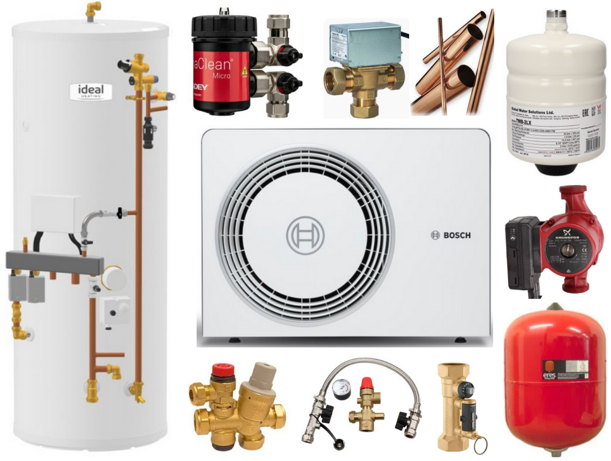

# Impediments to UK Heat Pump Adoption and Possible Solutions

The preceding story, [Considerations for the Fabric First vs Heat Pump First Debate](https://medium.com/@peter-wurmsdobler/considerations-for-the-fabric-first-vs-heat-pump-first-debate-950788085cf1), reaches the conclusion that a balanced "Heat Pump First with Sensible Insulation" yields an optimal approach to domestic heating. Yet, there are some major impediments to the adoption of air-source heat pumps for British homes: capital expenditure, space requirements and the "spark gap". The latter refers to the ratio of electricity to gas price which is quite often larger than the [Coefficient of Performance](https://en.wikipedia.org/wiki/Coefficient_of_performance) (COP) obtained with a heat pump; as a result the operational costs for domestic heating with a heat pump through electricity are higher than heating with gas. The former refers to prohibitive upfront costs of a heat pump system installation due to oversized pumps, complex system design with many discrete components, related plumbing work and space requirements: the focus of this article. The conclusion here is that a heat pump installation will have to be on par in complexity and cost with a gas boiler installation in order to become acceptable to the majority of homeowners and not only to early adopters who are prepared to put up with higher costs and hassle.

## Historic Context in the UK

The standard central heating system in the UK consists of the following components: a "system" boiler, at times installed into the builder's opening of the chimney breast as "back boiler", a vented hot water tank in an "airing cupboard" (often found in the 1st floor), complex pipework for this vented system, i.e. a heating system header tank and a cold water storage tank in the loft (gravity low pressure system feeding both cold and hot water taps), single panel radiators (varying diameters from 8mm, 10mm to 15mm) and other paraphernalia distributed over the house. The power rating of the gas boiler is about 10-15kW because the hot water storage can be used as a thermal buffer. Also, people used to take mostly baths, the running of which does not need high pressure. Those who do have showers later installed a power shower to boost the water pressure from the vented hot water tank; some still use an electric shower connected to the cold water mains.

Then came the transition to the high efficiency combi(nation)-boiler which would operate the central heating system (integrated circulation pump) and produce domestic hot water (DHW) on demand: mains water is heated directly by burning gas and transferring energy through a heat exchanger. This boiler could simply be installed instead of the system boiler; it made all header tanks as well as the hot water tank superfluous. The power rating was and is mostly determined by the larger of the two numbers: the space heating and the DHW demand. It is usually the second one that determines the result: flow rate × ΔT × thermal capacity of water. A 10l/min flow (a bucket a minute) and heating water from 5°C to 40°C (ΔT = 35°C) yields: 10/60 kg/s × 35K × 4.18kJ/kg/K = 24.5kW, so quite substantial power due to water's high specific thermal capacity.

Nowadays a range of installations can be found in UK homes: an estimated 10% use the traditional system, 30% use a modern condensing boiler with integrated hot water tank, and 60% use a condensing combi-boiler. When the latter was installed, radiators may have been updated at the same time, or it was ensured that the pipes to the radiators are 15mm. Quite often the space where the hot water tank was has been repurposed. Now, if one wanted to move on to a heat pump and maintain the habit of taking showers (with their implicit power demand), one would either need a heat pump at an industrial rating of 25kW+, or one has to bring back the hot water tank. One thing is certain: UK homes are small in comparison to continental houses and in general do not have a basement (at least in Cambridge) nor a plant room. So where does one put all the equipment?

## Costs of a Real Installation

An internet search for heat pumps will generally show the external visible unit with its big fan. However, the capital expenditure for a heat pump installation extends well beyond this outdoor unit typically featured in marketing materials, or in [Considerations for the Fabric First vs Heat Pump First Debate](https://medium.com/@peter-wurmsdobler/considerations-for-the-fabric-first-vs-heat-pump-first-debate-950788085cf1). While the outdoor unit itself costs £3,000-£8,000 depending on capacity, a complete installation requires numerous additional components, extensive plumbing work, and substantial labour. Total cost in the UK typically ranges from £15,000 to £25,000, even after accounting for the £7,500 Boiler Upgrade Scheme (BUS) grant. A typical heat pump system installation includes:

**Core Heat Pump Components:**
- Outdoor unit (air-source heat pump): £3,000-£8,000
- Indoor unit/controls: £500-£1,500

**Hot Water System:**
- Hot water cylinder (insulated thermal store, 100-300L): £800-£2,000
- Primary expansion vessel (heating circuit): £150-£300
- Secondary expansion vessel (DHW circuit, if separate): £100-£200

**Hydraulic Components:**
- Circulation pump(s) for radiator circuit: £200-£400
- Diverter valves (3-way or 4-way): £150-£400
- Buffer tank (optional, for system stability): £400-£800
- Pressure relief valves: £50-£100
- Fill and drain valves: £30-£80

**Pipework and Insulation:**
- Pipe upgrades to 15mm diameter (possibly): £500-£1,500
- Refrigerant lines (split systems): £300-£600
- Pipe insulation (lagging): £200-£500
- Condensate drain: £100-£200

**Controls and Sensors:**
- Smart thermostat/controller: £200-£500
- Flow and return sensors: £100-£300
- Outdoor temperature sensor: £50-£100
- DHW cylinder sensors: £50-£150

**Electrical Work:**
- Dedicated circuit upgrades (typically 32A): £300-£800
- Wiring and consumer unit modifications: £200-£500

**Labour and Installation:**
- Design, heat loss calculation and grant application: £300-£800
- Installation labour (2-5 days, multiple tradespeople): £3,000-£8,000
- Building control notifications: £100-£300
- Commissioning and testing: £300-£600

**Total typical cost: £15,000-£25,000** (before BUS grant)

This complexity represents a significant impediment to adoption. Many consumers (60%) are accustomed to combi-boilers occupying minimal space. Installers often propose elaborate systems with high labour costs that remain prohibitive despite government subsidies. Furthermore, the user has to accommodate the system by sacrificing valuable internal space.

## Commoditisation of Heat Pumps

Modern combi-boilers replaced complex multi-component heating systems with single integrated appliances, reducing both installation time and costs. A similar transition for heat pumps through standardisation and component integration could follow this trajectory. A standardised heat pump system would require five basic connections:

- Mains water input (for DHW),
- Mains electricity input with power supply to external unit,
- Flow/return connections to heating system (radiators and/or underfloor),
- Flow/return connections to external unit (mono-bloc configuration),
- Hot water output (DHW).

### Examples of Integrated Systems

Several manufacturers have developed systems approaching this integration:

- **Viessmann Vitocal 151-A:** Indoor 60cm × 60cm × 190cm unit comparable to the Vitodens 222-F, nearly a drop-in replacement,
- **Bosch Compress 6800i AW MB:** New generation heat pump with 60cm × 60cm indoor footprint, unfortunately not available in the UK,
- **Vaillant aroTHERM Plus:** 7kW heat pump with 190L uniTOWER cylinder, 60cm × 70cm footprint.

### Potential Benefits of Integration

Integrated system design could reduce installation complexity through:
- Factory assembly and testing of hydraulic components at scale,
- Standard appliance footprint dimensions (approximately 60cm × 60cm),
- Height ranging from 100cm to 200cm depending on hot water tank capacity,
- Pre-plumbed configurations reducing copper work and on-site labour,
- Modular designs for different DHW capacities.

This approach could potentially reduce:
- Installation time from 3-5 days to 1-2 days,
- Labour costs through fewer trades required,
- Component costs through volume manufacturing,
- System complexity with fewer connection points.

In contrast to current installation costs of £15,000-£25,000, with integrated appliances and simplified installation procedures, total costs might reduce to £8,000-£12,000 (including installation), though this assumes achieving manufacturing economies of scale comparable to white goods. 

## Radiator Compatibility and Control Systems

Radiator replacement constitutes a significant cost in heat pump installations. Heat pumps operate at lower flow temperatures (35-45°C) compared to gas boilers (60-80°C), and installers commonly recommend upgrading to larger, double-panel radiators in order to transmit the same amount of heat. However, advanced control systems offer an alternative approach that may reduce or eliminate this requirement.

### Control System Challenges

Traditional Thermostatic Radiator Valves (TRVs) present operational challenges with heat pumps. TRVs were designed for high-temperature gas boiler systems with bypass circuits. When a TRV closes to limit room temperature, it restricts flow, which conflicts with the heat pump's requirement for constant high-volume, low-temperature circulation. Both central heat pump control and TRVs will start beating each other, resulting in oscillations and poor performance.

For properties with consistent occupancy and uniform heating requirements, a properly designed system with correctly sized and balanced radiators can be modulated centrally through common flow and flow temperature, with all zones responding uniformly. However, for properties with variable occupancy patterns or differential zone heating needs (living room at 21°C and bedroom at 17°C), distributed intelligent control offers additional functionality. Modern control systems address these challenges through:

- **MIMO control** (Multiple-Input Multiple-Output) treating the home as an interconnected thermal environment,
- **Predictive algorithms** incorporating weather forecasts and occupancy patterns,
- **Zone management** allowing different temperature profiles without flow restriction,
- **Weather compensation** adjusting flow temperature based on outdoor conditions.

### The Adia Hub Approach

[Adia Thermal](https://adiathermal.co.uk/)'s Adia Hub system provides one method for managing existing radiator infrastructure through intelligent control rather than hardware replacement. The system comprises:

- Smart thermostatic valves on each radiator,
- Room temperature sensors throughout the home,
- Central controller implementing optimisation algorithms,
- Heat pump integration via Modbus/TCP communication.

This configuration enables the system to maximise flow volume by fully opening valves when heat is needed, operate at lower temperatures with extended run times, balance heat delivery dynamically across rooms, and optimise energy consumption based on variable electricity pricing. Reported benefits include:
- Reduced installation time from 5 days to 2 days,
- Elimination of most radiator replacements (saving £2,000-£5,000)
- Minimal additional components beyond DHW cylinder and expansion vessel,
- Compatibility with multiple heat pump brands (Ideal, Haier, Samsung, Vaillant, Midea, Bosch Compress 2000).

The Adia Hub currently interfaces with several heat pump manufacturers through standardised Modbus/TCP communication. Extension to additional brands, or direct integration of similar control logic into manufacturer systems, could broaden adoption. Traditional suppliers excel at mass manufacturing pumps and components but have less experience in modern software development, creating opportunities for collaboration or licensing arrangements.

## Integrated System Configuration

An integrated heat pump system suitable for UK residential properties would combine hardware simplicity with intelligent control:

**Outdoor Unit:**
- Mono-bloc air-source heat pump with all refrigerant components contained,
- Weatherproof construction with acoustic output below 45 dB,
- Capacity matched to building requirements (typically 3-10kW).

**Indoor Unit** (60cm × 60cm footprint, up to 2m tall):
- Integrated insulated hot water cylinder (100-300L),
- Plate heat exchanger for instantaneous DHW from mains,
- Circulation pump for heating circuit,
- Expansion vessels for heating and DHW circuits,
- Diverter valves for heating/DHW priority management,
- Pre-assembled and tested hydraulic components,
- Integrated controls and communication interfaces.

**Standard Connections:**
- Single electrical connection to internal unit also powering external unit,
- Mains cold water input and hot water output (DHW),
- Connection to outdoor unit (2 insulated pipes),
- Heating flow and return (2 pipes).

This configuration occupies space equivalent to a floor-standing combi-boiler or washing machine, compatible with typical UK homes without basements or plant rooms.

### Control Options

Once the hardware has been commoditised by companies that have experience in making white goods, the added value and differentiation lies mostly in the control system which can be offered by third parties through cloud services such as [Havenwise](https://www.havenwise.co.uk/) or [Adia Thermal](https://adiathermal.co.uk/) as software only:

**Integrated Smart Controller:**
- Weather compensation,
- Time-of-use tariff optimisation,
- DHW scheduling with legionella protection,
- Self-learning algorithms for occupancy patterns,
- Remote monitoring and control capability.

**Smart Zone Management:**
- Heat pump integration via standard protocols (Modbus/TCP),
- Wireless smart radiator valves in all rooms,
- Hub controller for MIMO optimisation,
- Multi-zone temperature profiles,
- Room temperature sensors,
- Dynamic flow balancing.

### Installation and Economics

Installation could proceed over two days: removal of existing boiler, positioning of indoor and outdoor units, and pipe connections on day one; electrical work, commissioning, and control installation on day two. The estimated costs with this approach:

- Equipment: £5,000-£8,000 (assuming mass production at white goods scale),
- Installation: £2,000-£3,000 (simplified 2-day procedure),
- Total: £7,000-£11,000, after £7,500 BUS grant: £0-£3,500 net cost

These figures assume achievement of manufacturing economies of scale and adoption of simplified installation procedures. Implementation would require coordination among manufacturers for integration and production scaling, standards bodies for communication protocol definition, policy makers for appropriate incentive structures, and installers for streamlined deployment methods. If that can be achieved, the main impediments for the adoption of heat pumps in the UK would be removed and an exponential market expansion would follow.