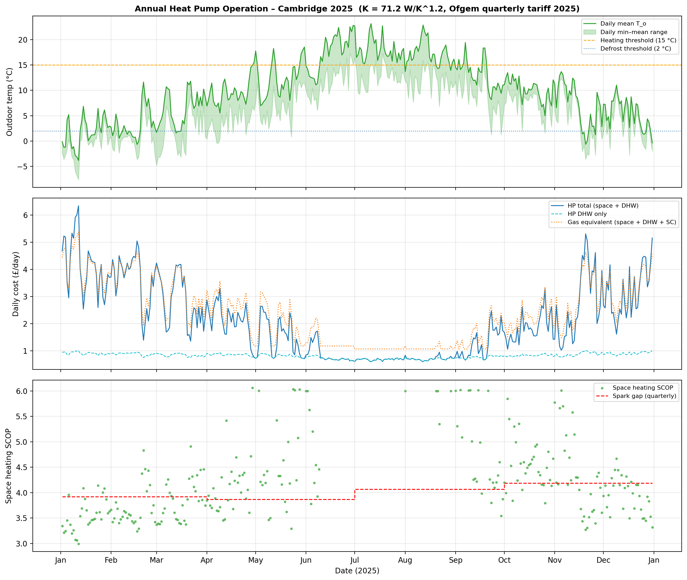
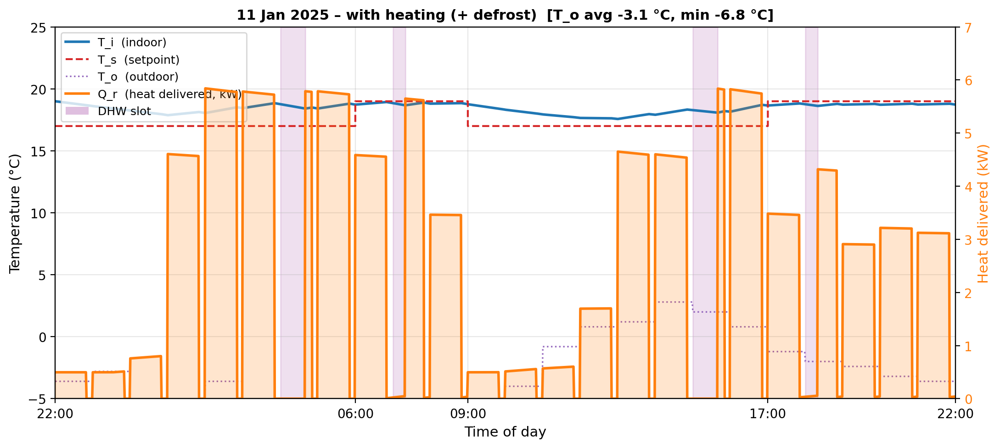
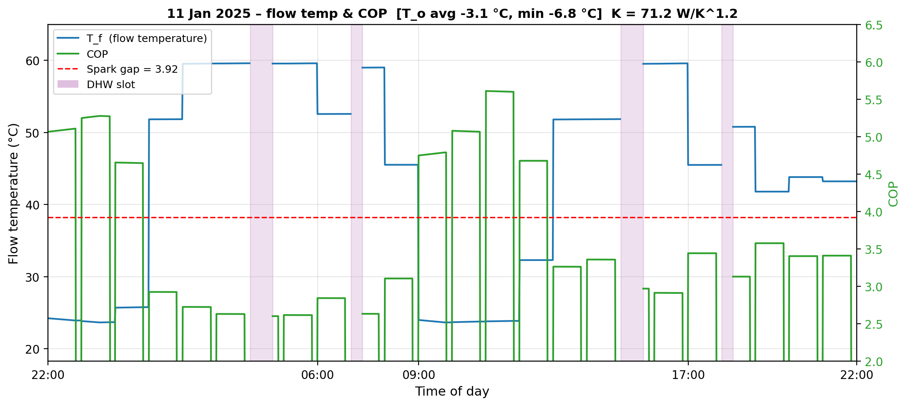
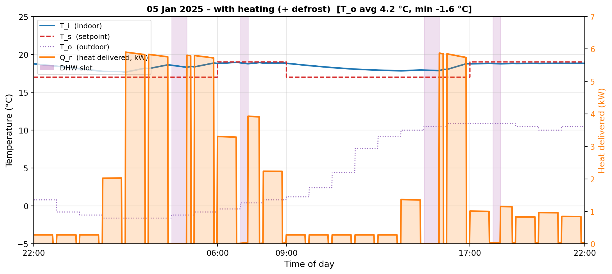
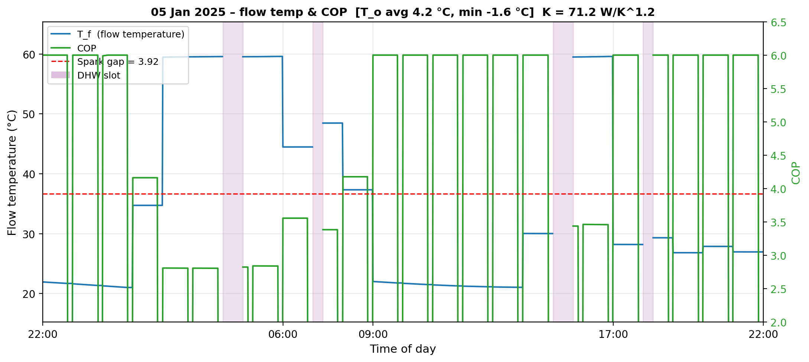
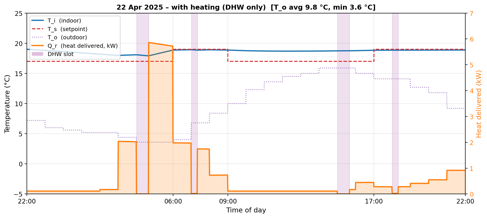
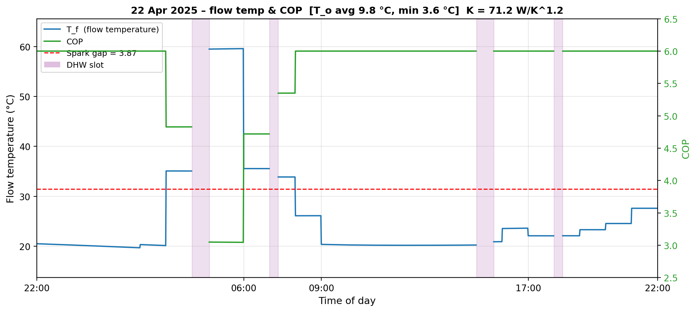
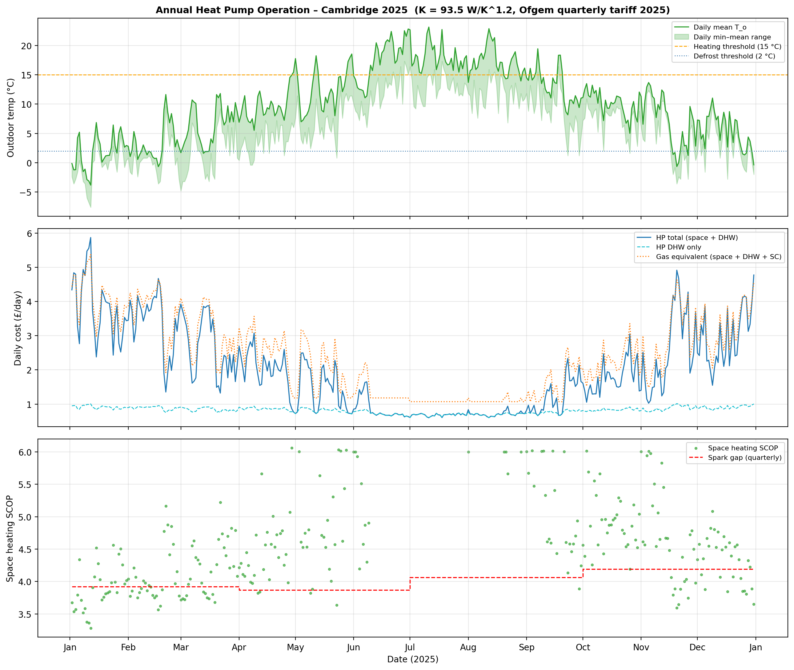

# Quantitative Analysis of Heat Pump Operation for Space Heating and Domestic Hot Water

The preceding stories, [Quantitative Analysis of Dynamic Heat Pump Operation for Design Temperature](https://medium.com/@peter-wurmsdobler/quantitative-analysis-of-dynamic-heat-pump-operation-for-design-temperature-51df19846000) and [Quantitative Analysis of Heat Pump Operation for Domestic Hot Water](https://medium.com/@peter-wurmsdobler/quantitative-analysis-of-heat-pump-operation-for-domestic-hot-water-855b59c1b163) respectively investigate heat pump operation for space heating and domestic hot water at specific outdoor conditions. This story combines both models using recorded outdoor temperature data for one year into a simulation in order to estimate what the total cost of running a heat pump at a standard tariff would have been and compare the result with a gas boiler.

*Figure: Our cat would probably prefer the smooth operation of a heating system with a heat pump throughout the year.*

# Operating Conditions

The object of investigation is the 1930s house as described in [Improving the Thermal Performance of UK 1930s Semi Detached Houses](https://peter-wurmsdobler.medium.com/improving-the-thermal-performance-of-uk-1930s-semi-detached-houses-6f64c6514565), with its dynamic properties derived in [Quantitative Analysis of Dynamic Heat Pump Operation for Domestic Heating](https://medium.com/@peter-wurmsdobler/quantitative-analysis-of-dynamic-heat-pump-operation-for-domestic-heating-723cbfb93e13): a thermal mass of C = 21.0 MJ/K, a heat transfer coefficient of h = 142.6 W/K, the associated time constant τ = C/h = 147,265 s (40.9 h), as well as some heating effect from appliances and occupants as Q_b = 500 W. The radiator constant is K = 71.2 W/K^1.2 and the equations governing the dynamic model are the same as in the aforementioned article. Previous articles identified that a 6 kW heat pump should be able to provide enough heat for both space heating and DHW. 

## Domestic Hot Water Requirements

As derived in the preceding article, the DHW requirement is assumed to be 200 l/day, with water heated from 10 °C to 55 °C, which requires 10.5 kWh of thermal energy; a heat pump rated at 6 kW requires about 1.75 hours to generate that amount of hot water. This is accommodated through four short slots: a 40-minute pre-heat at 04:00–04:40 charges the cylinder before the morning routine, with a 10-minute top-up at 07:00–07:10 to maintain hot water availability throughout the morning. The same pattern is repeated for the afternoon: a 40-minute pre-heat at 15:00–15:40 and a 15-minute top-up at 18:00–18:15 cover the evening. 

## Space Heating Requirements

Space heating is only required if the average daily outdoor temperature is below 15 °C, as internal gains (modelled) will produce enough heat to keep the house warm. If the heating is on, the target is:

- **Night (22:00–06:00)**: Maintain ~17°C setback,
- **Morning (06:00–09:00)**: Achieve 19°C comfort,
- **Day (09:00–17:00)**: Maintain ~17°C setback,
- **Evening (17:00–22:00)**: Achieve 19°C comfort.

The comfort period is set at an average of 19 °C, i.e. 20–21 °C in living areas, 18 °C in bedrooms, and cooler in the hallway, closer to 16 °C.

## Heat Pump Controller Design

The controller operates on a rolling 24-hour planning window that starts at 22:00 each evening, the end of the comfort period when the indoor temperature is expected to be at its setpoint. At this point the outdoor temperature sequence for the coming day is read from the recording (as a proxy for a good weather forecast), and two scheduling decisions are made: whether the 24-hour mean temperature is below 15 °C (in which case space heating is activated), and whether the minimum falls below 2 °C. In the latter case, an allowance of 10 minutes per hour (roughly 17 % of available heating time) is reserved for the heat pump to switch periodically into reverse mode to melt ice build-up on the outdoor heat exchanger coil. In all cases, the DHW generation slots are reserved before the space-heating schedule is computed.

When space heating is required, a feedforward plan is computed by solving a weighted least-squares problem: 24 hourly power levels are chosen to minimise the weighted sum of squared deviations from the target temperature profile, evaluated at every minute of the window. The optimiser assigns a uniform weight of 200 to all timesteps in the two comfort periods and a weight of 5 to setback periods. This uniform weighting within comfort windows distributes heat evenly across each period rather than concentrating it at one end. Power bounds for each hour are derived from the steady-state heat demand at the prevailing mean outdoor temperature: comfort hours and the two pre-comfort warm-up hours carry a higher minimum power to ensure the house reaches setpoint, whilst setback hours have a lower minimum that still maintains a 17 °C floor.

Once the hourly schedule is fixed it is executed minute by minute with a proportional correction term, capped at 30 % of the feedforward value, applied at each step to compensate for any discrepancy between the thermal model and the actual house response.

# Simulation Results

The simulation was run against outdoor temperatures recorded at the Cambridge Botanic Garden station throughout 2025, which provided 17,506 half-hourly readings. The daily planning cycle described above was applied to each of the 364 days from 2 January to 31 December, and the resulting heat pump electricity costs were accumulated and compared against a gas boiler operating at 95 % efficiency over the same period.

## Overall Results

Of the 364 days simulated, space heating was active on 270. On the remaining 94 days the mean outdoor temperature was at or above 15 °C, so the heat pump was only operated for DHW and only DHW costs were incurred. The cost calculations are based on the Ofgem energy price cap as detailed below (^2).

Over the 364 days, the heat pump delivered 6,982 kWh of space heating thermal energy, consuming 1,847 kWh of electricity. DHW required a fixed 3,822 kWh of thermal energy across all 364 days, consuming a further 1,146 kWh of electricity. Combined, the simulated system produced 10,804 kWh of useful heat from 2,992 kWh of electricity. This is consistent with the recorded annual gas consumption in 2025 of 11,508 kWh, which at 95 % boiler efficiency delivers around 10,932 kWh of useful heat; the modest difference of roughly 1 % shows that the model seems to replicate the real system rather well.

The mean space-heating SCOP across the 270 heating days was 4.18. The quarterly spark gaps for 2025 were 3.92 (Q1), 3.87 (Q2), 4.07 (Q3) and 4.19 (Q4). On an individual-day basis, the coldest winter days returned SCOPs in the range 3.0–3.5, below the quarterly spark gap, whilst milder days in spring and autumn reached 5–6. The mean SCOP of 4.18 exceeds the spark gap in Q1, Q2, and Q3, and sits approximately level with it in Q4.

The annual electricity cost for space heating and DHW combined was £771.15. The comparable gas cost, including the daily gas standing charge for every day of the year, was £876.42, giving an annual saving of £105.27 in favour of the heat pump. A material part of this saving is attributable to the gas standing charge, which accumulates to roughly £116 over the full year; without it, the two options would be similar in total energy cost under 2025 tariff conditions.

  
*Figure: Annual overview. Top: daily mean and minimum outdoor temperature with the 15 °C heating threshold and 2 °C defrost threshold. Centre: daily running cost for the heat pump (space + DHW) versus the gas equivalent. Bottom: space-heating SCOP on heating days, with the quarterly spark gap.*

## Specific Days

Three days were selected for detailed examination: the coldest recorded day in January, a more typical cold winter day also in January, and a mild spring day in April that still required some space heating. For each, a profile plot shows the indoor temperature, outdoor temperature, setpoint and heat delivered; a second plot shows the flow temperature and COP alongside the quarterly spark gap. The equivalent pair of plots for every simulated day is available in the [assets/annual](https://github.com/PeterWurmsdobler/heat-pump-cost/tree/main/assets/annual) folder on GitHub.

### Coldest Day

The coldest day identified in January 2025 was 11 January, with a mean outdoor temperature over the 22:00-to-22:00 simulation window of −3.1 °C and a minimum of −6.8 °C. With the minimum well below the 2 °C threshold, defrost cycles of 10 minutes per hour were included in the schedule.

  
*Figure: Indoor temperature, setpoint, outdoor temperature, and heat delivered on 11 January 2025.*

The heat pump delivered 60.2 kWh of space heat over the day, consuming 19.68 kWh of electricity, giving a space-heating SCOP of 3.06. At the Q1 tariff of 24.86p/kWh the space heating cost was £4.89. DHW required 3.99 kWh of electricity at a cost of £0.99, bringing the daily heat pump total to £5.88. The gas equivalent for the combined space and DHW load, at 95 % boiler efficiency and including the daily standing charge, was £5.11. On this most demanding day the heat pump ran at a higher daily cost than the gas alternative, consistent with the findings at design temperature reported in the preceding article.

  
*Figure: Flow temperature and COP on 11 January 2025. The dashed red line marks the Q1 spark gap of 3.92.*

The COP trace reflects the varying load through the day. During the overnight setback the heat pump runs at moderate power to hold 17 °C; at these levels the required flow temperature is lower and the COP sits in the range 4–5. When the pre-morning ramp begins, the greater power needed to bring the house to 19 °C raises the flow temperature towards 60 °C and the COP falls below 3.5, dropping below the Q1 spark gap. The evening comfort period follows a similar pattern.

### Cold Winter Day

A more typical cold winter day in Cambridge is illustrated by 5 January 2025, with a mean outdoor temperature of 4.2 °C and a minimum of −1.6 °C. The overnight minimum was below the 2 °C defrost threshold, so defrost cycles were included alongside DHW slots.

*Figure: Indoor temperature, setpoint, outdoor temperature, and heat delivered on 5 January 2025.*

The heat pump delivered 35.5 kWh of space heat, consuming 10.33 kWh of electricity at a SCOP of 3.44. At the Q1 tariff of 24.86p/kWh the space heating cost was £2.57. DHW required 3.48 kWh of electricity at a cost of £0.87, giving a daily heat pump total of £3.43 against a gas equivalent of £3.46 — a difference of just 3p. At conditions like these, where nights are still below freezing but days are mild, the heat pump and gas boiler run at broadly similar daily costs; any advantage from the SCOP is largely offset by the Q1 spark gap and the defrost penalty.

*Figure: Flow temperature and COP on 5 January 2025. The dashed red line marks the Q1 spark gap of 3.92.*

With a milder mean outdoor temperature than the coldest day, the required flow temperatures are lower and the COP improves during the setback and daytime periods, reaching 6 during light heating runs in the afternoon. The morning and evening ramp-ups still push the flow temperature towards 60 °C, momentarily depressing the COP. The integrated SCOP of 3.44 remains below the Q1 spark gap of 3.92, reflecting that at this point of the heating season the unit energy economics still favour gas; it is the gas standing charge and the milder spring days that tip the annual balance in favour of the heat pump.

### Mild Spring Day

The mild spring day selected was 22 April 2025, with a mean outdoor temperature of 9.8 °C and a minimum of 3.6 °C. No defrost was required; only DHW slots interrupted the heating schedule.

  
*Figure: Indoor temperature, setpoint, outdoor temperature, and heat delivered on 22 April 2025.*

The heat pump delivered 17.8 kWh of space heat, consuming 4.40 kWh of electricity at a SCOP of 4.05. At the Q2 tariff of 27.03p/kWh the space heating cost was £1.19, with £0.86 for DHW, giving a total heat pump cost of £2.05. The gas equivalent was £2.49, a saving of £0.44 on this day.

  
*Figure: Flow temperature and COP on 22 April 2025. The dashed red line marks the Q2 spark gap of 3.87.*

At milder outdoor temperatures the reduced heat demand requires lower flow temperatures, and the COP improves accordingly. On this day the COP reached above 5 during the steady setback periods, well above the Q2 spark gap of 3.87. The morning ramp-up, where higher power is needed to bring the house from 17 °C to 19 °C, temporarily raised the flow temperature and reduced the COP. The day's integrated SCOP of 4.05 was nonetheless comfortably above the Q2 spark gap of 3.87.

## Radiator Upgrade

As established in [Radiator Upgrades](https://github.com/PeterWurmsdobler/heat-pump-cost/blob/main/radiator-upgrade.md), replacing all radiators with higher-output models raises the house radiator constant from K = 71.2 W/K^1.2 to K = 93.5 W/K^1.2. The larger surface area allows the same heat output at a lower flow temperature, which in turn raises the COP on every heating day. The full-year simulation was repeated with K = 93.5, with all other parameters unchanged.

The mean space-heating SCOP rises from 4.18 to 4.52, and the annual heat pump cost falls from £771.15 to £729.50, a reduction of £41.66. The gas cost is unaffected. The extra annual saving relative to the current radiators is therefore £41.66. At an estimated upgrade cost of £2,000, the simple payback period is approximately 48 years.

| | Current radiators (K = 71.2) | Upgraded radiators (K = 93.5) |
|---|---|---|
| Mean space-heating SCOP | 4.18 | 4.52 |
| Annual HP cost (space + DHW) | £771.15 | £729.50 |
| Annual gas cost (space + DHW + SC) | £876.42 | £876.42 |
| Annual saving vs gas | £105.27 | £146.93 |
| Extra annual saving from upgrade | — | £41.66 |
| Payback at £2,000 upgrade cost | — | 48 years |

*Figure: Annual overview with upgraded radiators (K = 93.5 W/K^1.2). The cost gap between heat pump and gas widens slightly compared to the current radiator installation, but the shape of the curves is otherwise similar.*

The conclusion is consistent with the design-temperature analysis: the upgrade shifts the SCOP upward and reduces running costs, but the energy savings it generates are too small relative to the capital cost to justify the investment on economic grounds alone. Whether it is worthwhile for other reasons, longer system life, quieter operation at lower flow temperatures, or a margin of comfort on the coldest days, is a separate question.

# Conclusion

Running a heat pump for both space heating and domestic hot water in Cambridge during 2025 would have cost approximately £771 against a gas equivalent of £876, a saving of around £105 with no radiator changes. A meaningful portion of that saving comes from eliminating the gas standing charge; the modest advantage on unit energy economics alone reflects the current UK spark gap rather than any limitation of the technology. A radiator upgrade to K = 93.5 W/K^1.2 would improve the annual SCOP from 4.18 to 4.52 and reduce the heat pump bill by a further £42, but at an estimated installation cost of £2,000 the payback period of roughly 48 years makes it difficult to justify on running-cost grounds. A greater benefit is more likely to come from time-of-use tariffs, such as Octopus Cosy, which allow heating to be shifted into lower-rate periods; that opportunity is not explored here.

Beyond the direct cost comparison, the indoor temperature profile produced by a heat pump controller differs noticeably from that of a gas boiler operated in the conventional way. A gas boiler is typically run at maximum power to recover quickly from a deep night setback, which means the house spends part of the morning warming up, part of the evening cooling down, and the overnight period well below the daytime temperature. The heat pump model here holds the indoor temperature at around 17 °C throughout the night, brings it steadily to 19 °C before the morning routine, and maintains that level across both comfort periods. In practice this is likely to feel more even and less draughty. A secondary benefit of the smaller overnight temperature swing is reduced condensation: when indoor surfaces stay above the dew point throughout the night, the moisture cycling that drives condensation on cold walls and windows is attenuated. This is a modest and often overlooked argument in favour of continuous low-temperature heating over intermittent high-temperature heating.

# References

1. **Boiler efficiency:** The Viessmann Vitodens 222-F condensing gas boiler achieves 95% efficiency under typical operating conditions and a rated power of 25 kW; radiator constant K = 71.2 W/K^1.2 (derived from house radiator survey data, see [Radiator Survey](https://github.com/PeterWurmsdobler/heat-pump-cost/blob/main/radiator-survey.md)).

2. **Energy costs**:  Ofgem energy price cap for a typical dual-fuel household paying by Direct Debit sets prices for 2025 as follows:

| Period (2025) | Electricity Unit Rate | Electricity Standing Charge | Gas Unit Rate | Gas Standing Charge |
|---|---|---|---|---|
| Jan – Mar | 24.86p / kWh | 60.97p / day | 6.34p / kWh | 31.65p / day |
| Apr – Jun | 27.03p / kWh | 53.80p / day | 6.99p / kWh | 32.67p / day |
| Jul – Sep | 25.73p / kWh | 51.37p / day | 6.33p / kWh | 29.82p / day |
| Oct – Dec | 26.35p / kWh | 53.68p / day | 6.29p / kWh | 34.03p / day |

3. **Heating costs**: The underlying assumption in the comparison is that households would always have an electricity supply; therefore, an electricity standing charge would be due in all cases and will not be included in the comparison. The gas standing charge, however, is added to the gas heating scenario as any other scenario would not incur that charge (assuming a fully electrified home).
