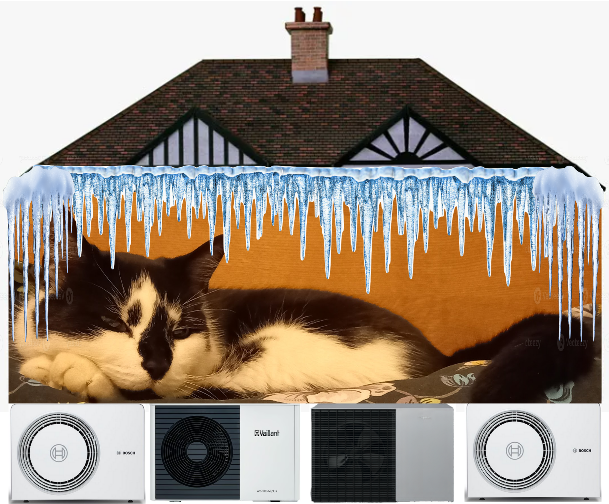
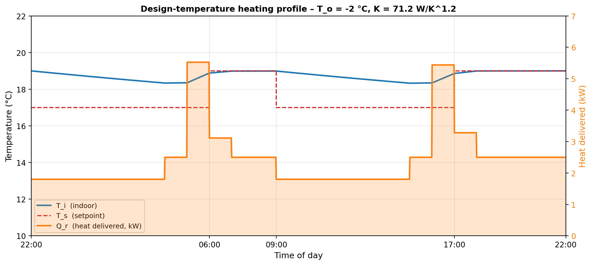
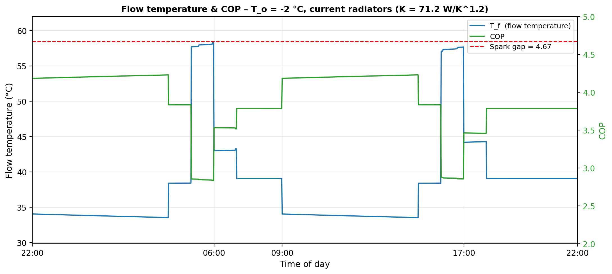
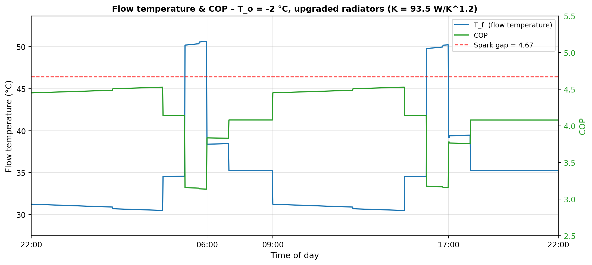
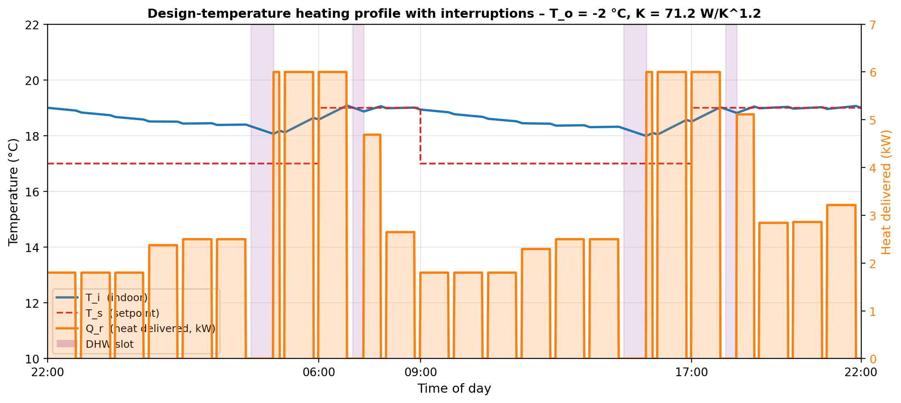
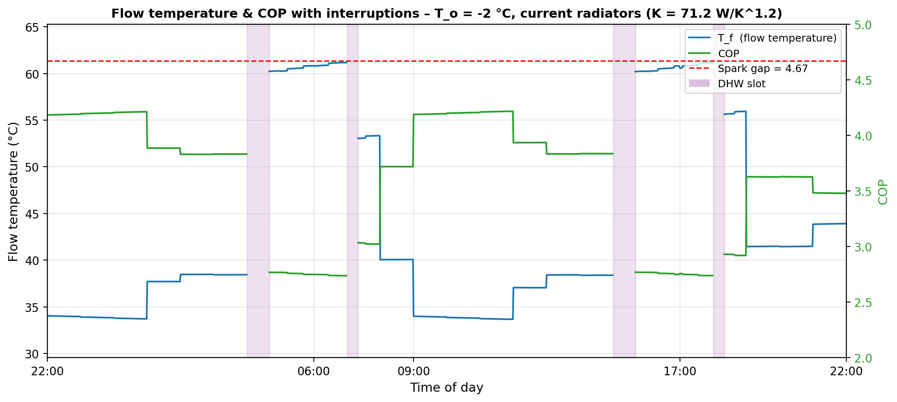
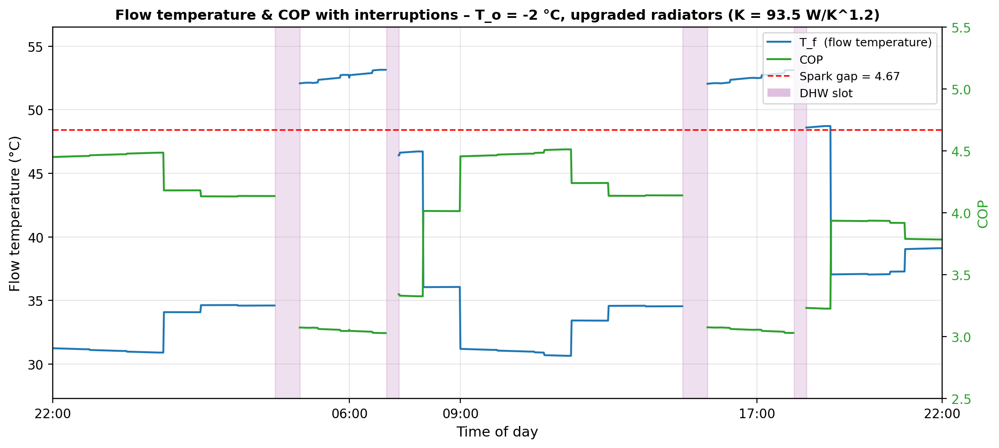

# Quantitative Analysis of Dynamic Heat Pump Operation for Design Temperature

The preceding story, [Quantitative Analysis of Dynamic Heat Pump Operation for Domestic Heating](https://medium.com/@peter-wurmsdobler/quantitative-analysis-of-dynamic-heat-pump-operation-for-domestic-heating-723cbfb93e13), highlights the importance of the operation of a heat pump in terms of heating schedule in order to keep the flow temperature low, COP high and cost low. There, a cold winter month with an outside average temperature of 5°C is used, which to a certain degree is quite representative for the coldest season in Cambridge, UK. This story investigates the heating system operation for the design temperature for the same location, −2°C, and presents the cost comparison between heating with gas, or a heat pump with current radiators, or after an upgrade.

*Figure: Our cat would probably prefer the smooth operation of a heating system with a heat pump in particular if it's cold outside.*

# Heat Pump for Heating Only

For this analysis, we use a feedforward planner that optimises a 24-hour heating schedule to meet a target temperature profile: an average of 19°C (20°C living areas, 18°C bedrooms, cooler hallway). The optimiser balances two objectives: achieving comfort quickly when needed while minimising flow temperatures to maximise efficiency. It computes hourly power levels that:

- **Pre-heat before comfort periods**: Ramp up power 2 hours before morning (06:00) and evening (17:00) schedules to reach 19°C smoothly, with peak power around 5.5–6 kW
- **Maintain comfort efficiently**: Once 19°C is achieved, reduce power to ~3 kW to hold temperature
- **Setback periods (night/day)**: Deliver steady baseline heating at ~2 kW to maintain ~17°C without excessive temperature drops

This approach is exemplary and many other optimisation strategies are conceivable, in particualr with feedback: model predictive control, rule-based schedulers, or machine learning planners could achieve similar results. It's all software, ultimately, and the physics of thermal inertia favours smooth, anticipatory heating over reactive control.

Assuming an outside temperature of −2°C, the total space heat required for one day is 60.0 kWh. If a gas boiler were used to supply that heat at 95% efficiency(^1), it would cost £4.10/day, including the gas standing charge.

*Figure: Heating power profile (right) and resulting indoor temperature (left).*

## Heat Pump With Current Radiators

Using the current radiators, K = 71.2 W/K^1.2, the necessary flow temperatures can be calculated as well as the resulting COP (see [COP estimation](https://github.com/PeterWurmsdobler/heat-pump-cost/blob/main/cop-estimation.md)). At 27.69p/kWh, the cost of space heating with a heat pump is £4.55/day, exceeding the gas baseline of £4.10/day because the achievable SCOP of 3.66 falls below the current spark gap of 4.67. A spark gap of 3.66 would allow the heat pump to break even without a radiator upgrade.

*Figure: Flow Temperature (left) and COP (right) at design temperature.*

## Heat Pump With Upgraded Radiators

In a survey in our house I have worked out how radiators could be upgraded and to what extent, details in [Radiator Upgrades](https://github.com/PeterWurmsdobler/heat-pump-cost/blob/main/radiator-upgrade.md).
Using the upgraded radiators, K = 93.5 W/K^1.2, the required flow temperatures can be calculated as well as the resulting COP. At 27.69p/kWh, the cost of space heating with a heat pump is £4.19/day, close to the gas baseline of £4.10/day. The SCOP of 3.96 approaches the current spark gap of 4.67; a spark gap of 3.96 would allow the heat pump to break even with the radiator upgrade.

*Figure: Flow Temperature (left) and COP (right) at design temperature with radiator upgrade.*

# Heating With Interruptions

The previous simulations assume that the heat pump is being used for space heating alone; most heat pumps also need to provide power for domestic hot water (DHW), which requires about 2 hours per day, depending on the power rating and amount of hot water needed. There is another factor to be taken into account at the negative design temeprature: defrost cycles. Periodically, the heat pump switches into reverse mode to melt ice build-up on the outdoor heat exchanger coil. Let's assume about 10 minutes every hour, so about 17% of the time.

Taking these times into account in our control algorithm needs to work out a heating schedule that maintains the temperature as defined above, but in addition make sure that we have hot water in the morning (for showers), and in the evening (washing up and shower). We accommodate this through four short DHW slots: a 40-minute pre-heat at 04:00–04:40 charges the cylinder before the morning routine, with a 20-minute top-up at 07:00–07:20 to maintain hot water availability throughout the morning. The same pattern is repeated for the afternoon: a 40-minute pre-heat at 15:00–15:40 and a 20-minute top-up at 18:00–18:20 cover the evening. A well-insulated hot water cylinder loses only a few degrees over several hours, so staggering the pre-heat and top-up in this way provides reliable hot water while keeping each space-heating interruption short.

Assuming an outside temperature of −2°C, the space heat delivered in the available hours (excluding DHW slots and defrost downtime) is 59.1 kWh/day. If a gas boiler were used to supply that heat at 95% efficiency, it would cost £4.04/day, including the gas standing charge. Note that only space heating costs are compared in this section; domestic hot water costs will be covered separately.

*Figure: Heating power profile (right) and resulting indoor temperature (left), with gaps.*

## Heat Pump With Current Radiators

Using the current radiators, K = 71.2 W/K^1.2, the necessary flow temperatures can be calculated as well as the resulting COP. At 27.69p/kWh, the cost of space heating with a heat pump is £4.88/day (space heating only), compared to the gas baseline of £4.04/day. The space heating SCOP of 3.36 sets the break-even spark gap; a spark gap of 3.36 would allow the heat pump to break even without a radiator upgrade.

*Figure: Flow Temperature (left) and COP (right) at design temperature, with gaps.*

## Heat Pump With Upgraded Radiators

Using the upgraded radiators, K = 93.5 W/K^1.2, the new flow temperatures can be calculated as well as the resulting COP. At 27.69p/kWh, the cost of space heating with a heat pump is £4.47/day (space heating only), close to the gas baseline of £4.04/day. The space heating SCOP of 3.67 sets the break-even spark gap; a spark gap of 3.67 would allow the heat pump to break even with the radiator upgrade.

*Figure: Flow Temperature (left) and COP (right) at design temperature with gaps and radiator upgrade.*

# Conclusion

At design temperature (−2°C), the heat pump costs more to run than a gas boiler regardless of whether the radiators are upgraded. Without an upgrade, the space heating SCOP is 3.36; with upgraded radiators it improves to 3.67. Both fall below the current spark gap of 4.67, which means the heat pump cannot break even on unit energy costs alone at these extreme conditions. The radiator upgrade closes the gap (SCOP 3.36 → 3.67) but does not change the outcome. Conversely, the spark gap only needs to fall to 3.36 to make the current radiator setup break even, not an outrageous number in comparison to European countries. As renewables are being built in the UK, gas price will set the electricity price less often (about 90% currently), and consequently, the spark gap will decrease and approach 3 or less in due course.

For now, the difference in space heating cost at design temperature conditions (including DHW and defrost interruptions) between current and upgraded radiators is £0.41/day. The upgrade would cost about £2000 at least, in materials and labour (rerouting pipes is involved), which translates into about 4,900 design-temperature days to recover the investment. At roughly 12 such days per year (according to the Cambridge Botanic Garden station), recovery takes about 408 years. In contrast, during the more typical cold winter months (T_o = 5°C), smooth heat pump operation with the current radiators already costs £1.96/day against a gas baseline of £2.42/day, 19% cheaper. All conditions combined, the seasonal economics remain in favour of the heat pump without any radiator upgrade.

*Analysis conducted on a 1930s semi-detached house. Code and methodology available at [github.com/PeterWurmsdobler/heat-pump-cost](https://github.com/PeterWurmsdobler/heat-pump-cost).*

# References

1. **Boiler efficiency:** The Viessmann Vitodens 222-F condensing gas boiler achieves 95% efficiency under typical operating conditions and a rated power of 25kW; radiator constant K = 93.5 W/K^1.2 (from manufacturer specifications, see [Radiator Upgrade](https://github.com/PeterWurmsdobler/heat-pump-cost/blob/main/radiator-upgrade.md)).

2. **Energy costs**: as of January 2026, Ofgem energy price cap for a typical dual-fuel household paying by Direct Debit sets electricity at 27.69p per kWh with a 54.75p daily standing charge, and gas at 5.93p per kWh with a 35.09p daily standing charge. 
