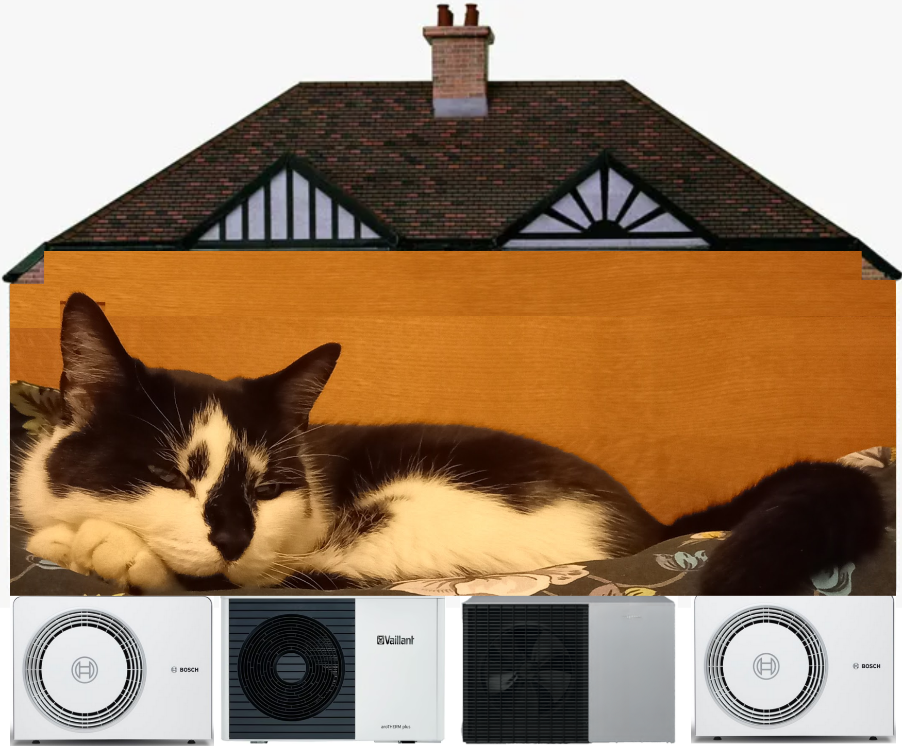
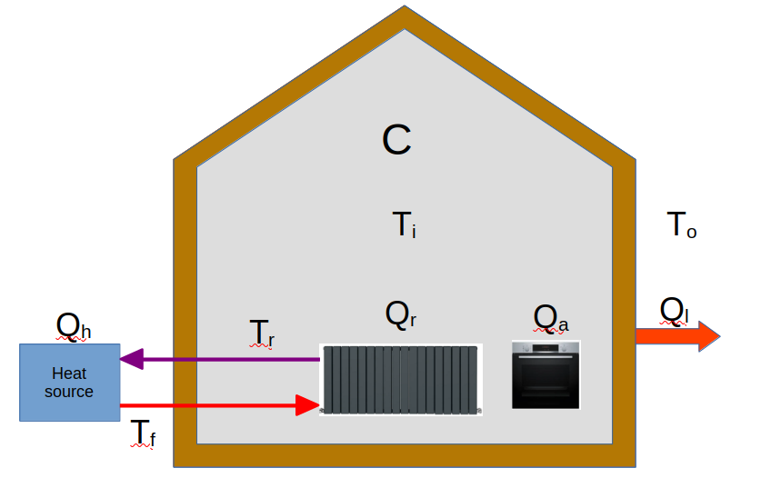
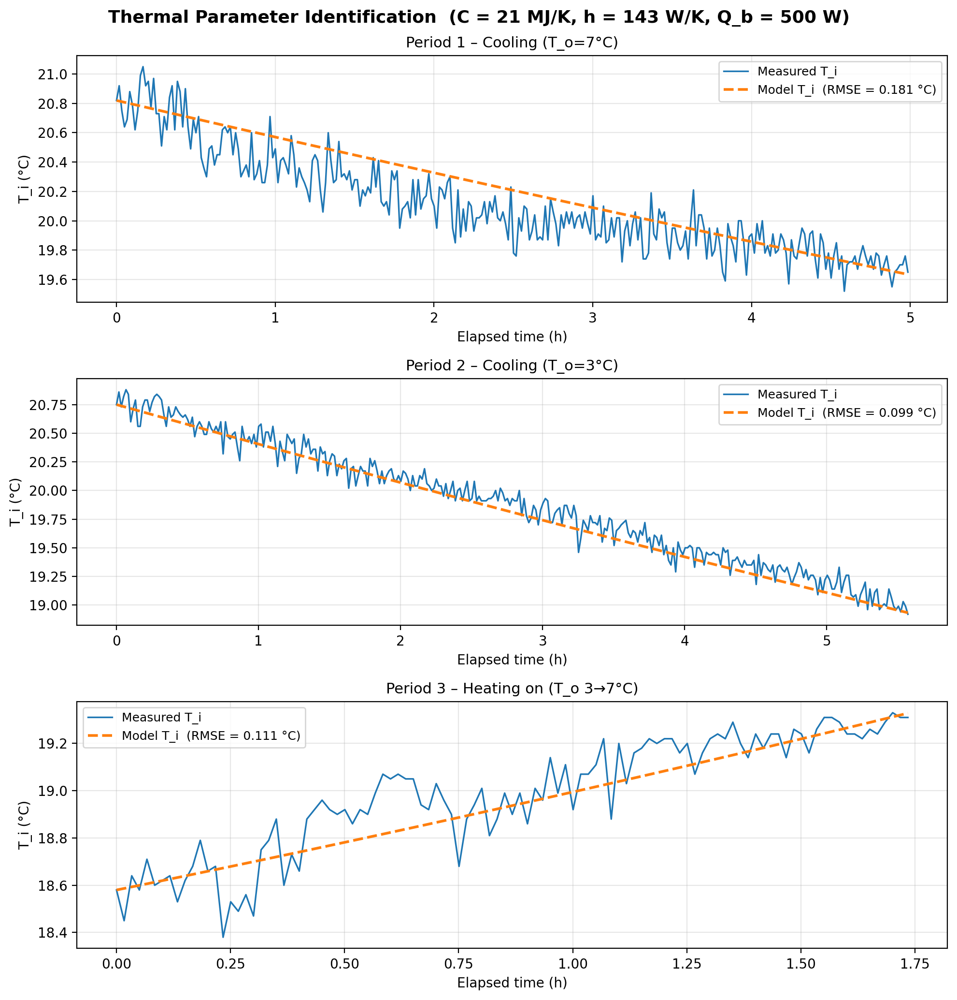
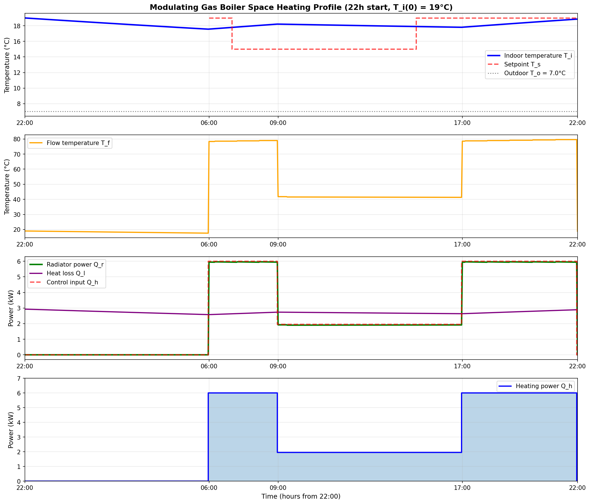
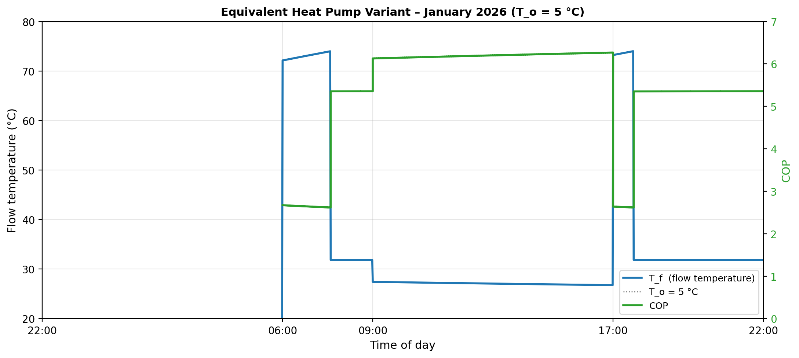
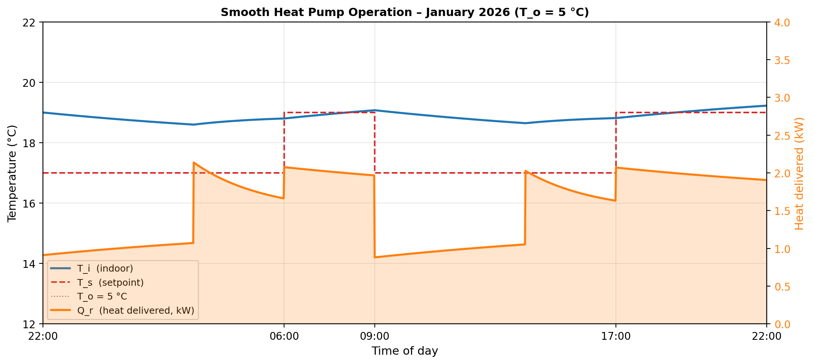
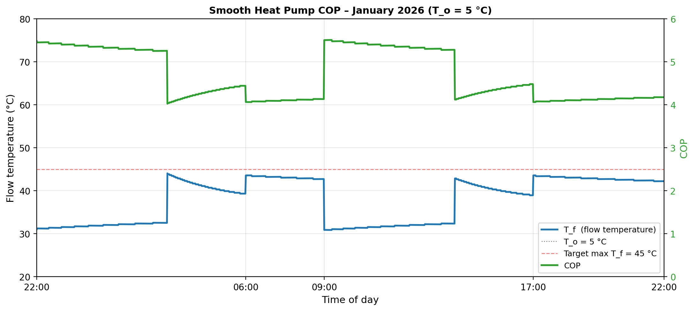
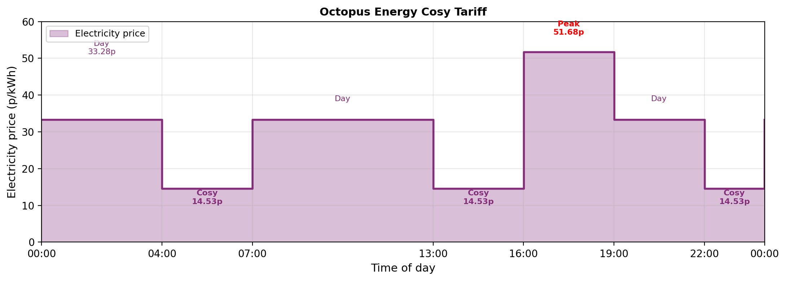
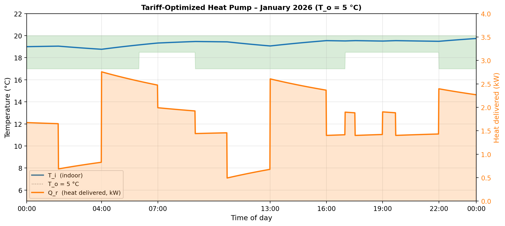
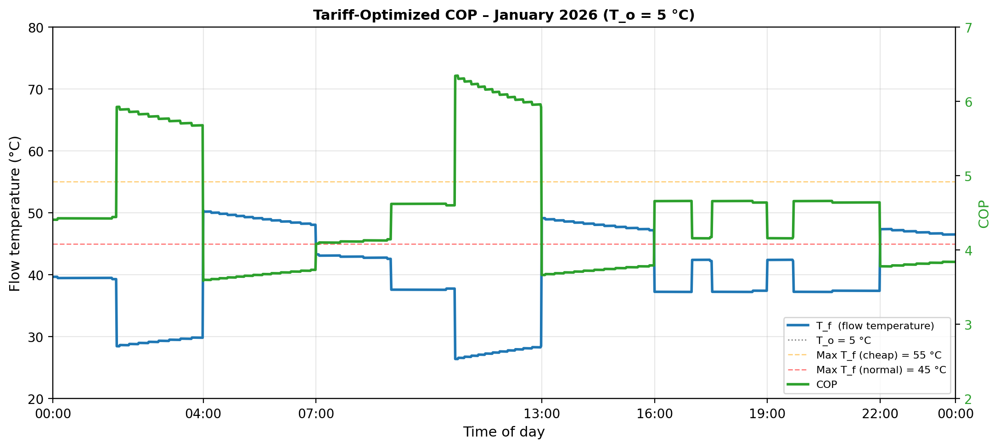

# Quantitative Analysis of Dynamic Heat Pump Operation for Domestic Heating

The preceding story, [How the Spark Gap Drives Radiator Upgrades for Heat Pump Installations ](https://medium.com/@peter-wurmsdobler/how-the-spark-gap-drives-radiator-upgrades-for-heat-pump-installations-1d3b098b29fd), addresses the implications of the spark gap on capital and operational expenses due to a nearly unavoidable upgrade in radiator capacity in order to keep the flow temperature low and the [Coefficient of Performance](https://en.wikipedia.org/wiki/Coefficient_of_performance) (COP) high; there, a simple static thermal analysis looks at average quantities for heat loss and temperature for a heat pump in stationary operation. The situation changes if dynamic aspects are taken into account for the operation of the heat pump, both in terms of temperature profiles and electricity tariffs. As presented in sources such as ["So You're Thinking About a Heat Pump: The UK Homeowner's Guide to Heat Pumps"](https://www.amazon.co.uk/Youre-Thinking-About-Heat-Pump/dp/B0GK7H511K/), heat pumps require different operating strategies compared to gas boilers most households are used to. The objective of this story is to demonstrate quantitatively how control and operation strategy impacts the economics of domestic heat pump heating. 

*Figure: Our cat would probably prefer the smooth operation of a heating system with a heat pump.*

# Dynamic Modelling

A stationary model assumes all process variables to be constant at a given point of operation: for a constant outdoor temperature a constant heating power is required to maintain a constant indoor temperature by compensating a constant heat loss. While this static analysis can provide some insight in minimum requirements for heating at various operating points, a dynamic analysis is looking at time-variant process variables such as heating power or flow temperature. To that end a dynamic model of the system is required first.

## Dynamic Thermal Model

A dynamic model reflects the time-variant behaviour of a system. Here, I would like to use the simplest conceivable model, a linear first order model with two time-invariant parameters: the thermal capacity C of the entire house, and the specific heat loss, or Heat Transfer Coefficient (HTC), or h. The following process variables will be considered: internal temperature T_i, and outside temperature T_o; heat is supplied as Q_h at flow temperature T_f and return temperature T_r, then transferred to the internal thermal mass as Q_r through radiators; in addition, occupancy and appliances are accounted for with a heating power of Q_b. The house loses heat as Q_l through the building fabric determined by h.

*Figure: Simple representation of a simple dynamic house model with heat source, capacity and losses.*

Differential equations are most commonly used to describe dynamic systems in combination with functional relationships between process variables; in this case, with the heating fluid (water) density ρ, its specific thermal capacity c_p and a flow rate V_f, the characteristic radiator constant K and radiative exponent n, and finally the transfer coefficient h, the equations are:

Q_h = V_f * ρ * c_p * (T_f - T_r) 
Q_r = K * ((T_f + T_r)/2 - T_i)^n 
Q_l = h * (T_i - T_o) 
C * dT_i/dt = Q_r + Q_b - Q_l

[How the Spark Gap Drives Radiator Upgrades for Heat Pump Installations ](https://medium.com/@peter-wurmsdobler/how-the-spark-gap-drives-radiator-upgrades-for-heat-pump-installations-1d3b098b29fd) has identified the values of some parameters for the dynamic analysis: K = 44.9 W/K^1.2 with n = 1.2, ρ = 1 kg/l and c_p = 4.18 kJ/kg/K; V_f is assumed to be constant at 20 l/min for this analysis; heat power is modulated through the flow temperature only. Also note, the heat balance for the radiator circuit (no losses in short pipework), is Q_h = Q_r. For the heat loss coefficient, we have two values as prior: h = 244 W/K from first principles, or h = 188 W/K from recorded power consumption; the appliance/occupancy heat source is about Q_b = 0.5 kW but could be more; C, the house's thermal capacity is completely unknown.

## Model Parameter Identification

An entire domain in control systems analysis and design is dedicated to model parameter identification, usually based on recorded data, or data obtained through a system response on a stimulus. To that end, we consider a simplified model that eliminates the heating system internals, but accounts for some background power Q_b (appliances, occupancy and other sources) and radiator power Q_r:

C * dT_i/dt = -h * (T_i - T_o) + Q_b + Q_r

In practical terms, we need to set up some experiments and record data. To obtain the internal temperature, a [Raspberry PicoPi Temperature Logger](https://github.com/LeonardWurmsdobler/PicoTemperatureLogger) records indoor temperature measurements. Outside temperatures are obtained from the [Cambridge Raw Daily Weather Data](https://www.cl.cam.ac.uk/weather/index-daily-text.html). We consider three periods:

- "2026-04-04 01:00:00" to "2026-04-04 06:00:00", outside T_o = 7°C, heating off, i.e. Q_r = 0, and Q_b ~0.5kW
- "2026-04-05 22:45:00" to "2026-04-06 04:20:00", outside T_o = 3°C, heating off, i.e. Q_r = 0, and Q_b ~0.5kW
- "2026-04-06 06:30:00" to "2026-04-06 08:15:00", outside T_o = 3°C - 7°C, heating on full power, i.e. Q_r > 0 kW, and Q_b ~0.5kW

Said system parameter identification tools are employed to obtain estimates for the missing parameters, C, h and Q_b; results as shown below, details on [Thermal Parameter Identification for the Dynamic House Model](https://github.com/PeterWurmsdobler/heat-pump-cost/system-identification.md). The parameters are found to be C = 21.0 MJ/K, h = 142.6 W/K, and the associated time constant τ = 146,937 s  (40.8 h), as well as Q_b = 500 W and Q_r = 4 kW during the morning heating period. Note, the time constant of 40.8 h means that the house  if left unheated would cool down by 63% towards the constant outside temperature after one time constant (40.8 h, roughly 1.7 days). 

*Figure: measured and estimated inside temperature based on the model in three conditions.*

# Dynamic Heating Simulation

Since we now have got a parameterised dynamic model, it should be possible to work out the dynamic heating requirements, too, and eventually the cost of heating with various sources. For this story, let's assume the January 2026 conditions with an average outdoor temperature T_o = 5°C. The heating requirement in a steady state would be Q_l = Q_r = 142.6 × 14 = **2.0 kW** to maintain an average of 19°C indoors, or ~48 kWh/day, to give a ballpark figure for the heating requirements. But houses are usually not maintained at a constant temperature throughout the day; this is where the dynamic simulation comes in.

## Gas Boiler Space Heating

Let's assume a traditional daily heating profile as pictured below using a gas boiler with a maximum power of 5.4kW(^1): heating off after 22h, heating on at 6h in the morning with a setpoint of T_s = 19°C and at full capacity, off at 9h when we leave the house but keep the house above as T_s = 15°C, on again at 17h until 22h with T_s = 19°C. The simplisitic relay-based thermostatic controller would do the following:

- if T_i < T_s, heat at full power until target temperature of T_s is reached; 
- once T_s is reached, feed-forward heating power Q_h = h * (T_s - T_o);
- when heating off, let the temperature decay naturally; 

*Figure: January day heated with gas boiler, heat = 33.8 kWh/day, £2.46/day.*

The gas boiler produces a peak power of 5.3 kW and deliver that heat through the flow temperature reaching 74°C to the existing radiators. The simulation shows that with a daily heat delivery of 33.8 kWh, the boiler consumes 35.6 kWh of gas (at 95% efficiency). The total daily cost is £2.46 (£2.11 gas energy + £0.35 gas standing charge).

## Equivalent Heat Pump Variant

Let's assume we install an equivalent heat pump capable of delivering the same power. Now, let's run the heat pump to deliver the same power, which would lead to the same flow and return temperatures at the same flow rate. Then let's look at the COP and the resulting electricity consumption. The flow temperature profile mirrors the power demand: when the house needs rapid heating in the morning and evening, the heat pump must push flow temperatures up to **74°C**, which reduces efficiency. The Coefficient of Performance varies throughout the day:

- During high-power warm-up periods (T_f ≈ 74°C): COP ≈ **2.7**
- During steady-state heating (T_f ≈ 37-43°C): COP ≈ **4.7**
- Overall seasonal average: **SCOP = 3.23**

With the power divided by the COP at each timestep, the total electricity consumption is **10.5 kWh/day**. At the January 2026 electricity price of 27.69 p/kWh, this would cost **£2.90/day**. Compare this to the gas boiler cost of £2.46/day, and we see that running a heat pump like a gas boiler on a flat tariff costs **18% more** than gas despite the favorable spark gap of 4.67. Conclusion: do not run a heat pump like a gas boiler; Q.E.D.

*Figure: January day with equivalent heat pump, heat = 33.8 kWh/day, electricity = 10.5 kWh/day, £2.90/day.*

## Smooth Operator Heat Pump

Let's devise a controller that operates more intelligently: continuous operation with varying power levels, maintaining baseline heating to prevent excessive temperature drops, and keeping flow temperatures low to maximize COP. The controller uses predictive logic with a 3-hour lookahead to pre-heat smoothly before comfort periods, and targets a maximum flow temperature of 45°C. The strategy uses continuous operation with realistic temperature targets:

- **Night (22:00–06:00)**: Maintain ~17°C with baseline 800W heating  
- **Morning (06:00–09:00)**: Achieve 19°C comfort with ramped power  
- **Day (09:00–17:00)**: Maintain ~17°C with baseline 800W heating  
- **Evening (17:00–22:00)**: Achieve 19°C comfort with ramped power

Running the heat pump continuously at low baseline power (800W) during off-peak hours prevents the deep temperature drops that require high-power recovery later. The indoor temperature remains between 17–19°C throughout, comfortable at all times. Power delivery varies smoothly from 0.8 kW overnight to 2.1 kW during comfort periods, avoiding the 0–5.3 kW on/off cycling. Total heat delivered is **36.7 kWh/day**, similar to the gas boiler but distributed more evenly, not only pleasant for cats.

*Figure: Smooth heat pump operation, heat = 36.7 kWh/day, electricity = 8.3 kWh/day, £2.29/day.*

The flow temperature profile reveals the efficiency advantage of continuous operation: temperatures range from 30–44°C instead of spiking to 74°C. During baseline heating periods, flow temperatures stay around 30–33°C, achieving COP values of 5.2–5.4. During comfort periods, temperatures reach 39–44°C with COP around 4.0–4.5. The overall seasonal COP of **4.44** is substantially higher than the 3.23 achieved with simple thermostat control. With electricity consumption of **8.3 kWh/day** at 27.69 p/kWh, the daily cost is **£2.29**—cheaper than both the simple thermostat heat pump at £2.90 and the gas boiler cost of £2.46.

*Figure: Continuous smooth operation maintains low flow temperatures and high COP throughout the day.*

This demonstrates that heat pump economics depend critically on control strategy: continuous operation with optimized flow temperatures and predictive pre-heating transforms the heat pump from 18% more expensive than gas to **7% cheaper**, while maintaining better comfort throughout the day. The economics could be improved further by moderately upgrading radiators in order to allow lowering the flow temperature even further, hence increasing the COP and decreasing electricity consumption.

## Playing the Dynamic Tariffs

Suppose electricity does not incur the same cost throughout the day, but rather a dynamic tariff such as with [Octopus Energy Cosy](https://octopus.energy/smart/cosy-octopus/), which offers three distinct rate periods designed to encourage load shifting away from peak demand hours:

- **Cosy rate** (04:00–07:00, 13:00–16:00, 22:00–00:00): **14.53 p/kWh** — cheap periods, 56% below standard rate
- **Day rate** (all other times): **33.28 p/kWh** — standard rate, 20% above flat tariff
- **Peak rate** (16:00–19:00): **51.68 p/kWh** — expensive period, 87% above flat tariff

*Figure: Octopus Energy Cosy tariff structure showing three rate periods throughout the day.*

The tariff structure creates a clear economic incentive to shift heating load from the evening peak (16:00–19:00) to the cheaper periods. With a dynamic model of the house thermal response, a cost-optimizing controller can exploit this price variation by using the building's thermal mass as a "battery" — pre-heating with higher flow temperatures during cheap periods and coasting through expensive ones. The optimization strategy maintains comfort bounds (17–20°C acceptable range throughout) while minimizing cost:

- **During cheap periods** (04:00–07:00, 13:00–16:00, 22:00–00:00): Heat at 2.4–2.7 kW with flow temperatures up to 50–55°C. This accepts lower COP temporarily to maximize thermal energy stored in the building fabric while electricity is cheap.
- **During peak period** (16:00–19:00): Reduce power to 1.4–1.9 kW, relying on stored thermal energy as temperature gradually drifts toward the lower bound.
- **During standard periods**: Maintain moderate heating (1.5–2.0 kW) with flow temperatures around 38–45°C to balance efficiency and comfort.

The controller looks ahead 4 hours to anticipate rate changes and begins pre-heating before cheap periods start. Temperature remains comfortably within 18.5–20°C for most of the day, briefly touching 18°C during transitions. Total heat delivered is **41.3 kWh/day** (higher than the 36.7 kWh from flat-rate optimization, due to increased losses from maintaining warmer average temperatures).

*Figure: Tariff-optimized heat pump operation, heat = 41.3 kWh/day, electricity = 10.0 kWh/day, £2.51/day.*

The flow temperature and COP profiles reveal the trade-off between efficiency and cost optimization. During cheap-rate pre-heating periods, flow temperatures reach 50–55°C with COP between 3.9–4.5. During the peak period, the controller minimizes heating power, allowing lower flow temperatures around 37–42°C maintaining COP of 4.0–4.3. During standard rate periods, moderate flow temperatures of 38–46°C achieve COP around 4.2–4.5. The overall seasonal COP of **4.13** is lower than the flat-tariff smooth operation (4.44) due to the aggressive pre-heating strategy, but this is compensated by buying more energy during cheap periods.

*Figure: Flow temperatures up to 55°C during cheap periods store maximum energy despite lower instantaneous COP.*

It is worth noting that the Octopus Cosy tariff used to offer a cheap rate as low as **8p/kWh**, at which point the economics would have been far more compelling. At today's cosy rates of 14.53p/kWh, the benefit is modest. Other time-of-use tariffs, such as **Octopus Agile**, use near-real-time spot pricing that can fall very low during periods of high renewable generation — or spike sharply at times of grid stress. A cost-optimizing controller with access to day-ahead prices could exploit those deeper discounts, but the outcome is inherently variable and harder to predict.

## Operational Limitations

These simulations only assume that the heat pump is being used for space heating; most heat pumps also need to provide power for domestic hot water. Given the thermal capacity of water (4.18 kJ/kg/K), a few people taking showers at a certain flow rate either needs a powerful heat pump, order of 20kW-30kW, or a hot water tank that is being heated gradually when time and cost permits. This periods are not available for space heating. For instance, heating 200 l/day of water from 10°C to 60°C requires 11.6 kWh of thermal energy; at a heat pump power rating of 6 kW, this requires about 2 hours for hot water generation. 

There is another factor to be taken into account in colder areas: defrost cycles. Periodically, the heat pump switches into reverse mode to make sure the pipework does not freeze up. 

# Comparison

Across the various heating strategies simulated, several key insights emerge about the economics and operation of heat pumps compared to gas boilers. All costs include heating energy and, for gas heating, the gas standing charge. The electricity standing charge is excluded from all scenarios as all households incur this charge regardless of heating method. The operating costs for January 2026 conditions (T_o = 5°C average) are:

- **Gas boiler (traditional on/off control)**: £2.46/day  
  Heat: 33.8 kWh/day, Gas: 35.6 kWh/day, Cost: £2.11 gas energy + £0.35 gas SC

- **Heat pump with simple thermostat control (mimicking gas boiler operation)**: £2.90/day (+18% vs gas)  
  Heat: 33.8 kWh/day, Electricity: 10.5 kWh/day, SCOP: 3.23, Cost: £2.90 energy  
  Flow temperatures spike to 74°C, reducing efficiency during warm-up periods.

- **Heat pump with smooth continuous operation (flat tariff)**: £2.29/day (−7% vs gas)  
  Heat: 36.7 kWh/day, Electricity: 8.3 kWh/day, SCOP: 4.44, Cost: £2.29 energy  
  Continuous baseline heating, flow temperatures 30–44°C, superior comfort and COP.

- **Heat pump with tariff-optimized operation (Octopus Cosy)**: £2.51/day (+2% vs gas)  
  Heat: 41.3 kWh/day, Electricity: 10.0 kWh/day, SCOP: 4.13, Cost: £2.51 energy  
  Pre-heating during cheap periods (14.53p), flow temperatures up to 55°C when electricity is cheap.

The smooth continuous heat pump operation achieves the lowest cost of all scenarios at £2.29/day—actually **7% cheaper than gas heating** while providing superior comfort. This demonstrates that heat pumps can not only match but beat gas economics when operated intelligently with optimized flow temperatures and predictive control. The tariff-optimized strategy on Octopus Cosy achieves near cost parity with gas at only 2% more expensive, while saving £0.26/day compared to running the same control strategy on a flat tariff.

# Conclusion

In summary, a heating system using a heat pump cannot be operated like one with a gas boiler; it needs an awareness of energy prices (e.g. day ahead prices on agile tariffs), weather patterns and predictions, and some minimum understanding of heat pump principles, in particular COP. The operation and the optimisation of the sytem become quite complex, also depending on the optimisation criteria, e.g. minimise energy, cost or CO2, or all of them, and to what proportion. Control strategy matters more than hardware. Consequently, there are some options:

- DIY: set up [Home Assistant](https://www.home-assistant.io/), automate your home with sensors and actuators, and spend your spare time on optimisation of the home energy system;
- use the energy management system that comes with a heat pump manufacturer which might even integrate other appliances, e.g. [Bosch Energy Managegment](https://www.bosch.com/stories/smart-home-energy-management-system/);
- outsource the optimisation to a specialist cloud software provider that manages all of that for you, learning from patterns across a wider user base, e.g. [Havenwise](https://www.havenwise.co.uk/) or [Adia Thermal](https://adiathermal.co.uk/).

# References

1. **Boiler efficiency:** The Viessmann Vitodens 222-F condensing gas boiler achieves 95% efficiency under typical operating conditions and a rated power of 25kW; radiator constant K = 44.9 W/K^1.2, flow temperature limit of 75°C and 20l/min flow rate yield Q_r = 5.4 kW. Most power is needed for DHW.

2. **Energy costs**: as of January 2026, Ofgem energy price cap for a typical dual-fuel household paying by Direct Debit sets electricity at 27.69p per kWh with a 54.75p daily standing charge, and gas at 5.93p per kWh with a 35.09p daily standing charge. 

3. **Heating costs**: The underlying assumption in the comparison is that households would always have an electricity supply; therefore, an electricity standing charge would be due in all cases and will not be included in the comparison. The gas standing charge, however, is added to the gas heating scenario as any other scenario would not incur that charge (assuming a fully electrified home).

4. **Octopus Cosy**: This tariff is location dependent and used to be quite interesting, cosy rate down to 8p/kWh. Now the rates are as follows. Day rate: 33.28p / kWh, Cosy rate (04:00 - 07:00, 13:00 - 16:00, 22:00 - 00:00): 14.53p / kWh, Peak rate (16:00 - 19:00): 51.68p / kWh; Standing charge: 52.19p / day. 
