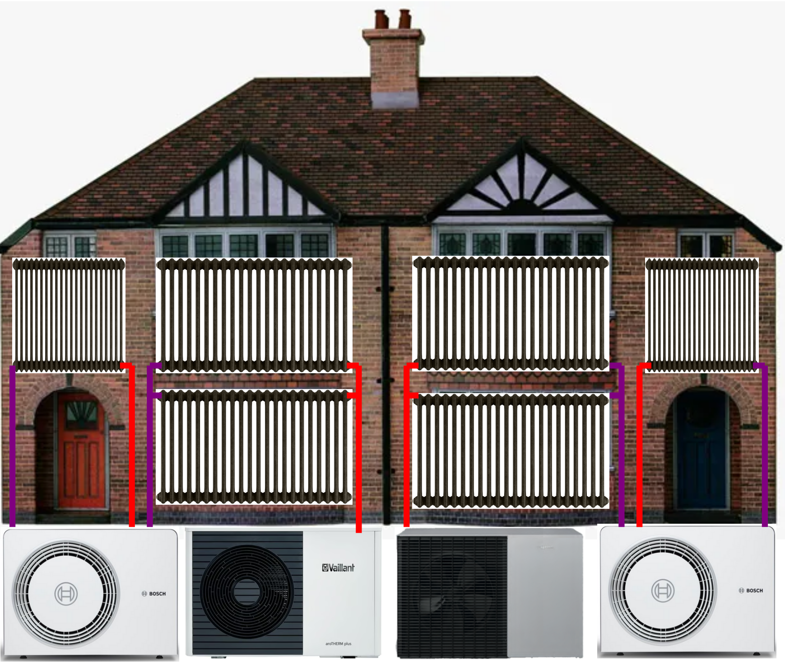

# How the Spark Gap Drives Radiator Upgrades for Heat Pump Installations 

The preceding story, [Impediments to UK Heat Pump Adoption and Possible Solutions](https://peter-wurmsdobler.medium.com/impediments-to-uk-heat-pump-adoption-and-possible-solutions-7d3812c091e4), addresses the complexity (and cost) of heatpump installation as one impediment to their wider adoption; this story is about the spark gap and its implication on capital and operational expenses in a perhaps not obvious way, namely through the implications for the radiator capacity.

Various sources such as ["So You're Thinking About a Heat Pump: The UK Homeowner's Guide to Heat Pumps"](https://www.amazon.co.uk/Youre-Thinking-About-Heat-Pump/dp/B0GK7H511K/) or [The Ultimate Guide to Heat Pumps: Britain's best installers and experts tell you exactly what to watch for and what to ask](https://www.amazon.co.uk/Ultimate-Guide-Heat-Pumps-installers/dp/B0FNMNVC4Q) recommend radiator upgrades which do unfortunately increase installation costs. Initially, I hoped to avoid such an upgrade by using a heat pump in tandem with our log burner. In order to be able to make a more informed decision, however, I have carried out a simple analysis using steady-state thermal models. 

The outcome doesn't come as a surprise: the spark gap, the ratio of the unit price of electricity to that of gas, currently stands at about 4.67(^2); this directly sets the minimum [Coefficient of Performance](https://en.wikipedia.org/wiki/Coefficient_of_performance) (COP) a heat pump must achieve to be cheaper to run than a gas boiler. Achieving that COP requires operating at sufficiently low flow temperatures, which in turn requires more radiator capacity. The radiator upgrades are therefore driven by the spark gap rather than being an inherent requirement of heat pump technology; whether they are needed depends on both the heating load scenario and which costs are accounted for. For average heating loads in our home, the current radiators turn out to be sufficient once the gas connection is fully decommissioned; a large upgrade is still required to meet the full peak design load economically. 

# Static Analysis and Heat Loss

The starting point of this analysis is the state of our property after the efforts detailed in [Improving the Thermal Performance of UK 1930s Semi Detached Houses](https://peter-wurmsdobler.medium.com/improving-the-thermal-performance-of-uk-1930s-semi-detached-houses-6f64c6514565). Therein, a heat transfer model derived from first principles estimates the specific heat loss, or Heat Transfer Coefficient (HTC), to be **244 W/K**. In order to work out a representative heat loss of the building, I chose a cold winter month in Cambridge, UK: the bleak January 2026 with an average outdoor temperature T_o = 5°C. During that time the indoor temperature was kept on average at T_i = 19°C (approximately 20°C downstairs, about 18°C upstairs). The resulting temperature difference is ΔT = 14K which yields a theoretical heat loss of Q_l = 244 × 14 = **3.42 kW**.

To validate this estimate, I looked up our energy consumption for January 2026: over that period electricity consumption was 263.75kWh (8.5kWh/day on average or 0.35kW continuous power), and gas utilisation was 1,924.91kWh (62.1 kWh/day on average or 2.59kW continuous power); the latter includes both space heating and domestic hot water (DHC). It is assumed that energy for DHC stays mostly the same throughout the year and is solely responsible for the gas use in summer; for instance, in summer 2025 gas usage was about 12.5 kWh per day on average. In addition, we have been using a log burner as supplemental heat source, providing approximately 3 kW output for 3 hours daily which contributes 9 kWh/day as heat (0.375 kW average power). Over the heating period we are using about 1m^3 of locally sourced hard wood for £150, which results in about £1/day.

After subtracting the estimated DHC portion (12.5 kWh/day) from total gas consumption (62.1 kWh/day), the remaining 49.6 kWh/day of gas provides 47.12 kWh/day of actual heat to the radiators at 95% boiler efficiency(^1), i.e. 1.96 kW average power. Electricity consumed by appliances and eventually dissipated as heat will add about 0.3 kW as a heating equivalent. All combined, the total average heating power estimate is 2.635 kW (radiators 1.96 kW + log burner 0.375 kW + appliances 0.3 kW). Consequently, the Heat Transfer Coefficient based on actual power consumption would be **188 W/K** with ΔT = 14K.

The actual heating power (2.635 kW) is about 77% of the theoretical heat loss from the thermal model (3.42 kW). This discrepancy is understandable, considering unaccounted solar gain and internal heat gains from occupants, as well as the fact that not all rooms are maintained at 19°C continuously (heating off from 10pm to 5am, and entrance hall more like 15°C) and we are using thick curtains for the main entrance, French doors and windows. 

## Stationary Model of a House

The model used here assumes a simple lumped-mass representation of the house with the following parameters: internal temperature T_i, and outside temperature T_o; heat is supplied as Q_h at flow temperature T_f and return temperature T_r, then transferred to the internal thermal mass as Q_r through radiators; supplemental heat Q_b is provided by a log burner, and Q_a from appliances. The house loses heat as Q_l through the building fabric.

*Figure: Simple representation of a simple house model with heat sources and losses.*

The individual heat contributions can be written using heating fluid (water) density ρ, its specific thermal capacity c_p and a flow rate V_f, the characteristic radiator constant K and radiative exponent n, and finally the transfer coefficient h, all together:

Q_h = V_f * ρ * c_p * (T_f - T_r) 
Q_r = K * ((T_f + T_r)/2 - T_i)^n = K × ΔT^n 
Q_l = h * (T_i - T_o)

In an equilibrium, or steady state, the heat balance for the radiator circuit (no losses in short pipework), is Q_h = Q_r, and for the room thermal balance, Q_l = Q_r + Q_b + Q_a; just as a side note, in a steady state the balance is invariant to the thermal mass. Overall, the radiator system must deliver:

Q_r = Q_l - Q_b - Q_a = h * (T_i - T_o) - Q_b - Q_a

For the January 2026 conditions, the theoretical heat loss is Q_l = 3.42 kW, the log burner contributes Q_b = 0.375 kW (average), appliances contribute Q_a = 0.3 kW, giving a required radiator output of Q_r = 2.745 kW (theoretical). Based on the gas bill, however, the radiator output was Q_r = 1.96 kW, with total estimated heat delivered to the home of 2.635 kW (1.96 + 0.375 + 0.3). The discrepancy is reconciled by the consumption-based Heat Transfer Coefficient of 188 W/K, which gives Q_l = 188 × 14 = 2.632 kW, hence Q_r = 2.632 - 0.375 - 0.3 = 1.957 kW ≈ 1.96 kW, matching actual gas consumption.

## Empirical Radiator Validation

The simplified stationary model treats all radiators as a single unit, assuming uniform flow and return temperatures through a well-balanced system. The characteristic constant K represents the combined heat transfer capacity of all radiators, i.e. all their surfaces and types, plus the heating contribution from pipework distributed throughout the house. My [Radiator Survey](https://github.com/PeterWurmsdobler/heat-pump-cost/radiator-survey.md) calculated this constant to be K = 71.2 W/K^1.2.

Using the radiator equation Q_r = K × ΔT^1.2 and Q_r = 1.96 kW gives 1960 W = 71.2 W/K^1.2 × ΔT^1.2, i.e. ΔT required works out to be 15.8 K and depends on both the indoor temperature 19°C and the mean radiator temperature which in turn depends on the flow rate and flow temperature; here we assume about 10 l/min which results in a mean radiator temperature of approximately 35°C (flow ~36°C, return ~34°C). These numbers correlate with the temperature perceived when touching the radiators during the day: they are warm, around the body temperature but never more than 40-45°C. 

## Operating Constraints

With our empirically validated radiator constant (K = 71.2 W/K^1.2), we can now explore the fundamental relationship between flow rate and flow temperature for delivering heating power. Using constants for water as the working fluid (ρ = 1 kg/l and c_p = 4.18 kJ/kg/K), with the January 2026 average conditions (T_o = 5°C and T_i = 19°C), and radiator exponent n = 1.2, there are combinations of flow temperature T_f and flow rate V_f that can deliver the same heating power, shown as curves at constant power in the following plot. In other words, a heating controller can modulate either the flow temperature T_f or the flow rate V_f to achieve the same effect (if not sabotaged by Thermostatic Radiator Valves, TRVs).

*Figure: Contour plot showing constant heating power curves. The 1.96 kW average radiator heating power is highlighted in red. This curve represents the operational constraint imposed by the current radiator capacity.*

The current radiators confine operation to the red 1.96 kW curve, which demonstrates the fundamental trade-off: low flow operation (~1 l/min) requires 49°C flow temperature with a large temperature drop to the return (ΔT ≈ 28 K), whilst high flow operation (~20 l/min) requires only 36°C flow temperature with a small temperature drop to the return (ΔT ≈ 1.4 K). At both extremes the mean radiator temperature is roughly the same (~35°C, determined by K and the heating load), but the higher flow rate achieves the target power with a much lower flow temperature which is what matters for the heat pump COP. 

# The Radiator Constant Impact

The contour plot shows something else: for a given radiator constant K and flow temperature, a horizontal line, the delivered heating power gets smaller and converges towards a constant with increasing flow rate; in other words, there is a limit to how much power can be delivered over existing radiators at a given flow temperature which is reached when the difference between radiator flow and return temperature goes to zero as the flow rate goes to infinity. Most pumps will struggle to reach that point as fluid dynamics will affect resistance and pumping power is limited; so practically, the maximum flow rate will be below 20l/min. The heat delivered becomes then a function of the flow temperature only, and so does the COP.

## Performance over Power

As already stated at the beginning, the spark gap is simply the ratio of the unit price of electricity to that of gas: at January 2026 prices, 27.69p/kWh divided by 5.93p/kWh gives 4.67(^2). For the heat pump to cost no more to run than the gas boiler it replaces, it must achieve a COP of at least 4.67; below that threshold, each unit of heat costs more to produce electrically than it would with gas. It is therefore perhaps revealing to show both the required flow temperature T_f and the achievable COP as a function of heat delivered, in our current setup (K = 71.2 W/K^1.2), bearing in mind that the heat pump needs to run at about 5°C above the radiator flow temperature since heat needs to be transferred from the internal heat pump refrigerant circuit to the radiator circuit. Three scenarios detailed below demonstrate the situation.

*Figure: For the current radiator constant K = 71.2 W/K^1.2, the flow temperature (left axis, blue) and the expected COP (right axis, green) plotted over heat power delivered. The red dashed line shows break-even COP = 4.67. The three marked points show: 1.96 kW with log burner (COP = 4.85, **above** break-even), 2.34 kW without log burner (COP = 4.56, slightly below), and 3.12 kW at peak condition (COP = 4.07, below).*

For all three scenarios the assumption is that the heat pump also covers domestic hot water, allowing the gas connection to be fully decommissioned and the standing charge of 35.09p/day (£0.35/day) to be saved.

### Scenario 1 Heat Pump With Log Burner

If the gas boiler is replaced with a heat pump whilst continuing to use the log burner for supplemental heat, the heat balance remains with radiators delivering Q_r = 1.96 kW, log burner providing Q_b = 0.375 kW, appliances contributing Q_a = 0.3 kW, and total heat Q_l = 2.635 kW (including internal gains). High flow operation optimised for the heat pump at 20 l/min requires a flow temperature of 36°C with return temperature ~35°C (ΔT ≈ 1.4 K), delivering 1.96 kW heating power. The estimated COP is 4.85 (at T_o=5°C, T_f=36°C), requiring electrical input of ~0.40 kW for daily electricity consumption of 9.7 kWh and daily electricity cost of £2.68 at 27.69p/kWh. Adding the log burner wood cost of £1.00/day gives a total daily cost of £3.68.

For comparison, with Q_r = 1.96 kW, the current gas-plus-log-burner baseline is: gas space heating £2.94/day + gas standing charge £0.35/day + log burner £1.00/day = **£4.29/day**. The heat pump at £3.68/day is £0.61/day cheaper, approximately 14% less expensive. The COP of 4.85 **exceeds** the spark gap of 4.67, so the heat pump already has an advantage on unit energy costs alone. Including the standing charge saving (£0.35/day), the heat pump is advantaged even further.

### Scenario 2 Heat Pump Without Log Burner

Without the log burner, the heat pump must provide the full heating requirement. Based on the heat balance equation (Q_r + Q_b + Q_a = Q_l), removing the log burner means that the total heat delivered Q_l = 1.96 + 0.375 + 0.3 = 2.635 kW (actual measured, including appliance gains) must now come from radiators and appliances, with Q_r = 2.335 kW required from the heat pump. Heat pump operation at maximum flow (20 l/min) requires a flow temperature of 38°C with return temperature ~37°C (ΔT ≈ 1.7 K), delivering 2.335 kW heating power. The estimated COP is 4.56 (at T_o=5°C, T_f=38°C), requiring electrical input of ~0.51 kW for daily electricity consumption of 12.3 kWh and a daily cost of £3.40 at 27.69p/kWh.

For comparison, with Q_r = 2.335 kW, the heat pump now covers what was previously provided by both the gas boiler and the log burner; the current baseline is therefore: gas space heating £2.94/day + standing charge £0.35/day + log burner £1.00/day = **£4.29/day**. The heat pump at £3.40/day is £0.89/day cheaper, approximately 20% less expensive. The COP of 4.56 sits just below the spark gap of 4.67, so on pure unit energy costs the heat pump does not quite break even; a spark gap of 4.56 would be sufficient. Taking the standing charge saving (£0.35/day) and the wood cost no longer incurred (£1.00/day) into account, the effective break-even COP drops to 3.62, which the COP of 4.56 readily exceeds.

### Scenario 3 Heat Pump Without Log Burner at Peak Condition

For a conservative design representing the theoretical full load during the coldest conditions, and without a log burner, appliances contribute Q_a = 0.3 kW, leaving the heat pump to deliver 3.42 - 0.3 = 3.12 kW. At maximum flow (20 l/min), this requires a flow temperature of ~43°C with return temperature ~41°C (ΔT ≈ 2.2 K), delivering 3.12 kW heating power. The estimated COP is 4.07 (at T_o=5°C, T_f=43°C), requiring electrical input of ~0.77 kW for daily electricity consumption of 18.4 kWh and a daily cost of £5.09 at 27.69p/kWh.

For comparison, with Q_r = 3.12 kW, had the log burner still been running it would contribute 0.375 kW, leaving the gas boiler to cover 2.745 kW via radiators at 95% efficiency: 69.3 kWh/day at £4.11/day. The current gas-plus-log-burner baseline at peak is therefore: gas space heating £4.11/day + standing charge £0.35/day + log burner £1.00/day = **£5.46/day**. The heat pump at £5.09/day is £0.37/day cheaper, approximately 7% less expensive. The COP of 4.07 sits below the spark gap of 4.67, so on pure unit energy costs the heat pump does not break even; a spark gap of 4.07 would be required. Taking the standing charge saving (£0.35/day) and the wood cost no longer incurred (£1.00/day) into account, the effective break-even COP would be 3.80, which the COP of 4.07 **exceeds**. Unlike the previous analysis, Scenario 3 is now also cheaper, though only marginally so.

## Adjusting the Radiator Constant

At this point it is clear that, on unit energy costs alone, the radiators need to be upgraded in order for the COP to exceed the break-even threshold of 4.67, i.e. the constant K needs to be higher, but to what extent? To this end, let's work out the flow temperature and the expected COP plotted over a variable radiator constant K, but for various heating powers: the base load with log burner (1.96kW), one without log burner (2.335 kW) and the peak condition (3.12 kW). The intersection with the minimum COP to break even should reveal the required K for each case. (Note, heat pump temperature needs to be 5°C above the radiator flow temperature).

*Figure: For three heating power levels, the flow temperature (left axis, solid lines) and the expected COP (right axis, dashed lines) plotted over radiator constant K. The circles mark where COP reaches 4.67 (break-even threshold at January 2026 prices). The current K = 71.2 already exceeds the break-even for 1.96 kW (blue). To achieve break-even on pure unit energy, K must increase to 76 for 2.34 kW (green, 1.07× current), and to 104 for 3.12 kW (red, 1.46× current). All break-even points converge to the same flow temperature of 37.1°C.*

With the current K = 71.2, Scenario 1 (1.96 kW with log burner) already **exceeds** the required COP of 4.67, achieving COP = 4.85. Because that COP threshold is set by the spark gap alone, all three break-even points converge to the same flow temperature of 37.1°C regardless of heating load; reaching that point requires progressively more radiator capacity as the heating load increases. For the 1.96 kW scenario with log burner, the current radiators are already sufficient. For the 2.335 kW scenario without log burner, K ≈ 76.4 W/K^1.2 (1.07× current) is required on pure unit energy, a modest upgrade. For the 3.12 kW peak condition, K ≈ 104.1 W/K^1.2 (1.46× current) is required, achievable by upgrading a few of the smaller radiators to Type 22.

# Conclusion

When accounting for the full cost picture, including the gas standing charge saving and elimination of wood burner costs, the heat pump proves cheaper than the current gas-plus-log-burner baseline across all three scenarios by 7–20%. The extent of radiator upgrades needed depends on whether pure unit energy costs alone need to beat gas, or whether the full cost comparison is used. For average heating loads, the current radiators are already sufficient; large upgrades are only required to meet the full peak design load at unit energy parity with gas. 

Should energy pricing shift (e.g. a move away from merit order based marginal pricing, or adding energy transition costs to gas rather than onto electricity), the spark gap would drop and required upgrades would become less severe. A spark gap below roughly 3.3 would bring the break-even flow temperature up high enough that no radiator upgrade would be needed at all, hence removing yet another impediment for heat pump adoption.

The situation changes, however, if dynamic operation is considered:

https://peter-wurmsdobler.medium.com/quantitative-analysis-of-dynamic-heat-pump-operation-for-domestic-heating-723cbfb93e13

*Analysis based on: 1930s semi-detached house, Code and methodology available at [github.com/PeterWurmsdobler/heat-pump-cost](https://github.com/PeterWurmsdobler/heat-pump-cost).*

# References

1. **Boiler efficiency:** The Viessmann Vitodens 222-F condensing gas boiler achieves 95% efficiency under typical operating conditions and a rated power of 25kW.

2. **Energy costs** as of January 2026, Ofgem energy price cap for a typical dual-fuel household paying by Direct Debit sets electricity at 27.69p per kWh with a 54.75p daily standing charge, and gas at 5.93p per kWh with a 35.09p daily standing charge. 

