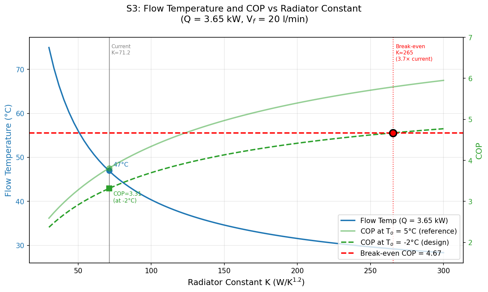

# How the Spark Gap Drives Radiator Upgrades for Heat Pump Installations 

The preceding story, [Impediments to UK Heat Pump Adoption and Possible Solutions](https://peter-wurmsdobler.medium.com/impediments-to-uk-heat-pump-adoption-and-possible-solutions-7d3812c091e4), addresses the complexity (and cost) of heat pump installation as one impediment to their wider adoption; this story is about another barrier, the spark gap, through its effect on the required radiator capacity.

Various sources such as ["So You're Thinking About a Heat Pump: The UK Homeowner's Guide to Heat Pumps"](https://www.amazon.co.uk/Youre-Thinking-About-Heat-Pump/dp/B0GK7H511K/) or [The Ultimate Guide to Heat Pumps: Britain's best installers and experts tell you exactly what to watch for and what to ask](https://www.amazon.co.uk/Ultimate-Guide-Heat-Pumps-installers/dp/B0FNMNVC4Q) recommend radiator upgrades which unfortunately increase installation costs. Initially, I hoped to avoid such an upgrade by using a heat pump in tandem with our log burner, but was not sure if that would work. To make a more informed decision, I carried out a simple analysis using steady-state thermal models. 

The outcome doesn't come as a surprise: the spark gap, the ratio of the unit price of electricity to that of gas, currently stands at about 4.67(^2); this directly sets the minimum [Coefficient of Performance](https://en.wikipedia.org/wiki/Coefficient_of_performance) (COP) a heat pump must achieve to be cheaper to run than a gas boiler. Reaching that COP requires operating at sufficiently low flow temperatures at a given external temperature; lower flow temperatures require more radiator capacity to shift the same power. The radiator upgrades are therefore driven by the spark gap rather than being an inherent requirement of heat pump technology; whether they are needed depends on both the heating load scenario and which costs are accounted for as investigated in this story. 

In short, for average winter heating loads in our home, the current radiators turn out to be sufficient once the gas connection is fully decommissioned. At design temperature conditions (-2°C for Cambridge), however, the current spark gap forces an economically absurd radiator upgrade (3.7×). Conversely, the current radiators could be kept at design conditions if the spark gap fell to roughly 3.3, not an outrageous number in comparison to European countries.

# Static Analysis and Heat Loss

The starting point of this analysis is the state of our property after the efforts detailed in [Improving the Thermal Performance of UK 1930s Semi Detached Houses](https://peter-wurmsdobler.medium.com/improving-the-thermal-performance-of-uk-1930s-semi-detached-houses-6f64c6514565). To work out the representative heat loss of the building, I looked at a cold winter month in Cambridge, UK: January 2026 with an average outdoor temperature T_o = 5°C. During that time the indoor temperature was kept on average at T_i = 19°C (approximately 20°C downstairs, about 18°C upstairs), giving a temperature difference of ΔT = 14 K. (Since 2022 we keep the temperatures a bit lower).

Energy consumption from different sources for January 2026 was as follows. Electricity 263.75kWh (8.5kWh/day on average or 0.35kW continuous power), and gas 1,924.91kWh (62.1 kWh/day on average or 2.59kW continuous power); the latter includes both space heating and domestic hot water (DHW). It is assumed that energy for DHW stays mostly the same throughout the year and solely determines the gas use in summer; for instance, in summer 2025 gas usage was about 12.5 kWh per day on average. In addition, we have been using a log burner as supplemental heat source, providing approximately 3 kW output for 3 hours daily which contributes 9 kWh/day as heat (0.375 kW average power). Over the heating period we are using about 1m^3 of locally sourced hardwood for £150, which results in about £1/day.

After subtracting the estimated DHW portion (12.5 kWh/day) from total gas consumption (62.1 kWh/day), the remaining 49.6 kWh/day of gas provides 47.12 kWh/day of actual heat to the radiators at 95% boiler efficiency(^1), i.e. 1.96 kW average power. Electricity consumed by appliances and eventually dissipated as heat will add about 0.3 kW as a heating equivalent. All combined, the total average heating power estimate is 2.635 kW (radiators 1.96 kW + log burner 0.375 kW + appliances 0.3 kW). This heating power compensates the heat loss of the house to maintain a constant temperature, or Q = h × ΔT, with h being the Heat Transfer Coefficient. Using the actual heating power, h = Q / ΔT = 2.635 kW / 14 K = **188 W/K**.

For comparison, the theoretical heat transfer model derived from first principles in the previous article estimates h = 244 W/K, which would give a theoretical heat loss of Q_l = 244 × 14 = 3.42 kW. The actual heating power (2.635 kW) is about 77% of the theoretical heat loss. This discrepancy is understandable, considering unaccounted solar gain and internal heat gains from occupants, as well as the fact that not all rooms are maintained at 19°C continuously (heating off from 10pm to 6am, and entrance hall more like 15°C) and we are using thick curtains for the main entrance, French doors and windows. For the remainder of this analysis, we use the empirical value of **188 W/K**. 

## Stationary Model of a House

The model used here assumes a simple lumped-mass representation of the house with the following parameters: internal temperature T_i, and outside temperature T_o; heat is supplied as Q_h at flow temperature T_f and return temperature T_r, then transferred to the internal thermal mass as Q_r through radiators; supplemental heat Q_b is provided by a log burner, and Q_a from appliances. The house loses heat as Q_l through the building fabric with Heat Transfer Coefficient h.

*Figure: House thermal model with heat sources and losses.*

The individual heat contributions can be written using heating fluid (water) density ρ, its specific thermal capacity c_p and a flow rate V_f, the characteristic radiator constant K and radiative exponent n, and finally the heat transfer coefficient h, all together:

Q_h = V_f * ρ * c_p * (T_f - T_r) 
Q_r = K × ΔT^n with ΔT = ((T_f + T_r)/2 - T_i) 
Q_l = h * (T_i - T_o) 

In an equilibrium, or steady state, the heat balance for the radiator circuit (no losses in short pipework), is Q_h = Q_r, and for the house's thermal balance, Q_l = Q_r + Q_b + Q_a. Overall, the radiator system must deliver:

Q_r = Q_l - Q_b - Q_a = h * (T_i - T_o) - Q_b - Q_a

For the January 2026 conditions with empirical h = 188 W/K and ΔT = 14 K, the total heat loss is Q_l = 188 × 14 = 2.632 kW. The log burner contributes Q_b = 0.375 kW (average), and appliances contribute Q_a = 0.3 kW, leaving the radiators to deliver Q_r = 2.632 - 0.375 - 0.3 = 1.957 kW ≈ 1.96 kW.

## Empirical Radiator Validation

The simplified stationary model treats all radiators as a single unit, assuming uniform flow and return temperatures through a well-balanced system. The characteristic constant K represents the combined heat transfer capacity of all radiators, i.e. all their surfaces and types, plus the heating contribution from pipework distributed throughout the house. My [Radiator Survey](https://github.com/PeterWurmsdobler/heat-pump-cost/blob/main/radiator-survey.md) calculated this constant to be K = 71.2 W/K^1.2 for the radiators installed in our house.

Using the radiator equation Q_r = K × ΔT^1.2 and Q_r = 1.96 kW gives 1960 W = 71.2 W/K^1.2 × ΔT^1.2, i.e. ΔT required works out to be 15.8 K and depends on both the indoor temperature 19°C and the mean radiator temperature which in turn depends on the flow rate and flow temperature; here we assume about 10 l/min which results in a mean radiator temperature of approximately 35°C (flow ~36°C, return ~34°C). These numbers are consistent with the temperature perceived when touching the radiators during the day: they are warm, around the body temperature but never more than 40-45°C. 

## Operating Constraints

With our empirically validated radiator constant (K = 71.2 W/K^1.2), we can now explore the relationship between flow rate and flow temperature for delivering heating power. Using constants for water as the working fluid (ρ = 1 kg/l and c_p = 4.18 kJ/kg/K), with the January 2026 average conditions (T_o = 5°C and T_i = 19°C), and radiator exponent n = 1.2, there are combinations of flow temperature T_f and flow rate V_f that can deliver the same heating power, shown as curves at constant power in the following plot. In other words, a heating controller can modulate either the flow temperature T_f or the flow rate V_f to achieve the same effect (if not sabotaged by Thermostatic Radiator Valves, TRVs).

*Figure: Constant heating power curves for the current radiators (K = 71.2 W/K^1.2); the 1.96 kW average load is highlighted in red.*

The red curve shows how 1.96 kW can be delivered with the current radiators: low flow operation (~1 l/min) requires 49°C flow temperature with a large temperature drop to the return (ΔT ≈ 28 K), whilst high flow operation (~20 l/min) requires only 36°C flow temperature with a small temperature drop to the return (ΔT ≈ 1.4 K). At both extremes the mean radiator temperature is roughly the same (~35°C, determined by K and the heating load), but the higher flow rate achieves the target power with a much lower flow temperature which is what matters for the heat pump COP. 

# The Radiator Constant Impact

The contour plot also shows that for a given radiator constant K and flow temperature T_f, the delivered heating power converges towards a constant with increasing flow rate V_f; in other words, there is a limit to how much power can be delivered over existing radiators at a given flow temperature which is reached when the difference between radiator flow and return temperature goes to zero as the flow rate goes to infinity. Most pumps will struggle to reach that point as fluid dynamics will affect resistance and pumping power is limited; so practically, the maximum flow rate will be below 20 l/min. The heat delivered then becomes a function of the flow temperature only, and so does the COP.

## Performance over Power

The spark gap is the ratio of the unit price of electricity to that of gas: at January 2026 prices, 27.69p/kWh divided by 5.93p/kWh gives 4.67(^2). For the heat pump to cost no more to run than the gas boiler it replaces, it must achieve a COP of at least 4.67; below that threshold, each unit of heat costs more to produce electrically than it would with gas. It is useful to show both the required flow temperature T_f and the achievable COP (at a given external temperature T_o) as a function of heat delivered in our current setup (K = 71.2 W/K^1.2). Note that the heat pump needs to run at about 5°C above the radiator flow temperature since heat needs to be transferred from the internal heat pump refrigerant circuit to the radiator circuit (see [COP estimation](https://github.com/PeterWurmsdobler/heat-pump-cost/blob/main/cop-estimation.md) for calculations). Three scenarios detailed below demonstrate the situation.

*Figure: Flow temperature (left axis, blue) and COP (right axis, green; solid for T_o = 5°C, dashed for T_o = -2°C) plotted against heating power at K = 71.2 W/K^1.2. The red dashed line marks the break-even COP of 4.67.*

For all three scenarios the assumption is that the heat pump also covers domestic hot water, allowing the gas connection to be fully decommissioned and the standing charge of 35.09p/day (£0.35/day) to be saved.

### Scenario 1 Heat Pump With Log Burner

If the gas boiler is replaced with a heat pump whilst continuing to use the log burner for supplemental heat, the heat balance remains with radiators delivering Q_r = 1.96 kW, log burner providing Q_b = 0.375 kW, appliances contributing Q_a = 0.3 kW, and total heat Q_l = 2.635 kW (including internal gains). High flow operation optimised for the heat pump at 20 l/min requires a flow temperature of 36°C with return temperature ~34°C (ΔT ≈ 1.4 K), delivering 1.96 kW heating power. The estimated COP is 4.85 (at T_o=5°C, T_f=36°C), requiring electrical input of ~0.40 kW for daily electricity consumption of 9.7 kWh and daily electricity cost of £2.68 at 27.69p/kWh. Adding the log burner wood cost of £1.00/day gives a total daily cost of £3.68.

For comparison, with Q_r = 1.96 kW, the current gas-plus-log-burner baseline is: gas space heating £2.94/day + gas standing charge £0.35/day + log burner £1.00/day = **£4.29/day**. The heat pump at £3.68/day is £0.61/day cheaper, approximately 14% less expensive. The COP of 4.85 **exceeds** the spark gap of 4.67, so the heat pump has an advantage on unit energy costs alone; the gas standing charge saving (£0.35/day) is already reflected in the total saving above.

### Scenario 2 Heat Pump Without Log Burner

Without the log burner, the heat pump must provide the full heating requirement. With Q_b = 0, the heat balance gives Q_r = Q_l - Q_a = 2.635 - 0.3 = 2.335 kW required from the heat pump. Heat pump operation at maximum flow (20 l/min) requires a flow temperature of 38°C with return temperature ~37°C (ΔT ≈ 1.7 K), delivering 2.335 kW heating power. The estimated COP is 4.56 (at T_o=5°C, T_f=38°C), requiring electrical input of ~0.51 kW for daily electricity consumption of 12.3 kWh and a daily cost of £3.40 at 27.69p/kWh.

For comparison, with Q_r = 2.335 kW, the heat pump now covers what was previously provided by both the gas boiler and the log burner; the current baseline is therefore: gas space heating £2.94/day + standing charge £0.35/day + log burner £1.00/day = **£4.29/day**. The heat pump at £3.40/day is £0.89/day cheaper, approximately 20% less expensive. The COP of 4.56 sits just below the spark gap of 4.67, so on pure unit energy costs the heat pump does not quite break even; a spark gap of 4.56 would be sufficient. Taking the standing charge saving (£0.35/day) and the wood cost no longer incurred (£1.00/day) into account, the effective break-even COP drops to 3.62, which the COP of 4.56 exceeds.

### Scenario 3 Heat Pump at Design Temperature

For planning and sizing heat pump capacity, it is standard practice to consider operation at the design outdoor temperature, typically -2°C for Cambridge, UK. At this design condition, the heat loss through the building fabric increases: with h = 188 W/K and ΔT = (19°C - (-2°C)) = 21 K, the total heat loss becomes Q_l = 188 × 21 = 3.948 kW. Subtracting appliance heat gains of Q_a = 0.3 kW, the radiators must deliver Q_r = 3.65 kW (assuming no log burner at design conditions for conservative sizing).

At maximum flow (20 l/min), delivering 3.65 kW requires a flow temperature of ~47°C with return temperature ~44°C (ΔT ≈ 2.6 K). However, the COP at design temperature is reduced by the cold outdoor air: at T_o=-2°C and T_f=47°C, the estimated COP is 3.32, requiring electrical input of ~1.10 kW for total daily energy consumption of 26.4 kWh and daily electricity cost of £7.31 at 27.69p/kWh.

For comparison with the current gas baseline at design conditions: gas consumption would be 3.65 kW / 0.95 = 3.84 kW gas input, costing 3.84 × 24 × 0.0593 = £5.47/day for space heating; adding the gas standing charge of £0.35/day gives a total of £5.82/day. The heat pump at £7.31/day is £1.49/day more expensive, a 26% cost premium. The COP of 3.32 sits below the spark gap of 4.67, or conversely, the spark gap only needs to be below 3.32 for the heat pump to be economically viable on unit cost alone.

## Adjusting the Radiator Constant

The following plots show flow temperature and COP as a function of radiator constant K, for two heating loads at T_o = 5°C: 1.96 kW with log burner (S1) and 2.34 kW without (S2). The required K is found where the COP curve crosses the break-even threshold of 4.67. The heat pump condenser operates at about 5°C above the radiator flow temperature, which is included in the COP calculation.

*Figure: Flow temperature (left axis, solid) and COP (right axis, dashed) plotted against radiator constant K for S1 (blue, 1.96 kW) and S2 (green, 2.34 kW) at T_o = 5°C. Circles mark the break-even COP of 4.67.*

With the current K = 71.2, Scenario 1 (1.96 kW with log burner) already **exceeds** the required COP of 4.67, achieving COP = 4.85. Because that COP threshold is set by the spark gap alone, all break-even points for scenarios at T_o = 5°C converge to the same flow temperature of 37.1°C regardless of heating load; reaching that point requires progressively more radiator capacity as the heating load increases. For the 1.96 kW scenario with log burner, the current radiators are already sufficient. For the 2.34 kW scenario without log burner, K ≈ 76.4 W/K^1.2 (1.07× current) is required on pure unit energy, a modest upgrade.

Scenario 3 at design temperature is a different matter. For the 3.65 kW design temperature condition at T_o = -2°C, break-even COP of 4.67 requires a flow temperature of only 29.2°C; the cold outdoor air demands a lower temperature lift to reach the same COP. Delivering 3.65 kW at 29.2°C means a mean radiator temperature of just 27.9°C, barely 9 K above indoor temperature. The required K is approximately 265 W/K^1.2, which is **3.73×** the current value; such a radiator upgrade is economically prohibitive.

*Figure: Flow temperature (left axis, red) and COP (right axis, green; solid for T_o = 5°C, dashed for T_o = -2°C) plotted against radiator constant K for S3 (3.65 kW at T_o = -2°C). The break-even marker sits at K ≈ 265 (3.73× current).*

# Conclusion

Including the gas standing charge saving and elimination of log burner costs, the heat pump costs less to run than the gas-plus-log-burner baseline at typical heating conditions (Scenarios 1 & 2) by 14–20%. At design temperature (Scenario 3: -2°C), it costs 26% more per day (£7.31 vs £5.82); such conditions occur in Cambridge roughly 1% of the heating season, so the seasonal balance remains in favour of the heat pump.

The radiator upgrades required in each scenario are a direct consequence of the spark gap. The spark gap sets the break-even COP, which sets the maximum permissible flow temperature, which in turn determines the minimum radiator capacity. At typical winter conditions the current radiators are sufficient or require only a small increase in K; at design conditions the required upgrade is disproportionate because the spark gap is large, not because of any inherent limitation of heat pump technology.

Should energy pricing change, for example through a move away from merit-order marginal pricing, by shifting energy transition costs from electricity to gas, or through increased renewable generation, the spark gap would fall and the required upgrades would become less onerous. A spark gap below roughly 3.32 would bring the break-even K for design conditions within the current radiator capacity. For typical winter conditions the threshold is roughly 4.65, which is essentially the current spark gap of 4.67.

The situation changes, however, if dynamic operation is considered:

https://peter-wurmsdobler.medium.com/quantitative-analysis-of-dynamic-heat-pump-operation-for-domestic-heating-723cbfb93e13

*Analysis based on: 1930s semi-detached house, Code and methodology available at [github.com/PeterWurmsdobler/heat-pump-cost](https://github.com/PeterWurmsdobler/heat-pump-cost).*

# References

1. **Boiler efficiency:** The Viessmann Vitodens 222-F condensing gas boiler achieves 95% efficiency under typical operating conditions and a rated power of 25kW.

2. **Energy costs** as of January 2026, Ofgem energy price cap for a typical dual-fuel household paying by Direct Debit sets electricity at 27.69p per kWh with a 54.75p daily standing charge, and gas at 5.93p per kWh with a 35.09p daily standing charge. 

