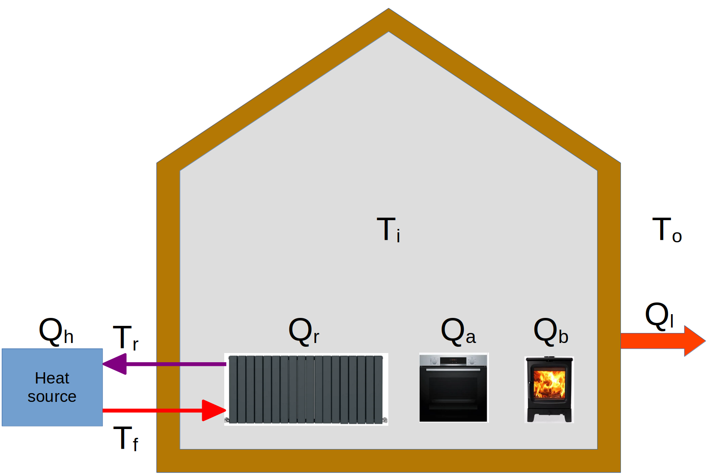
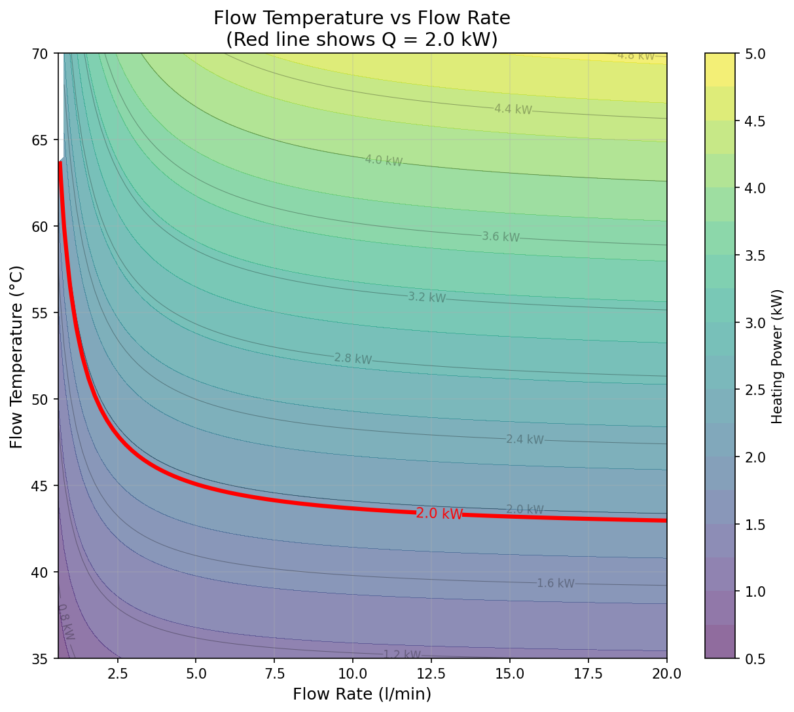
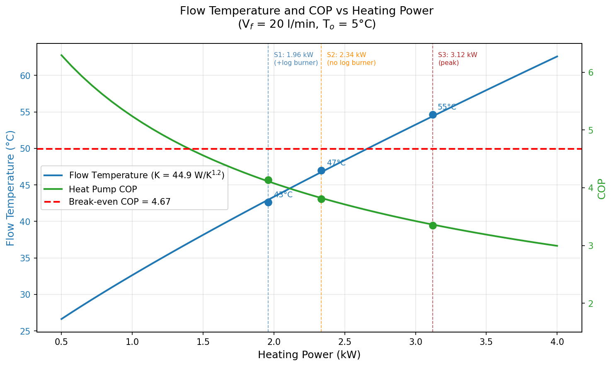
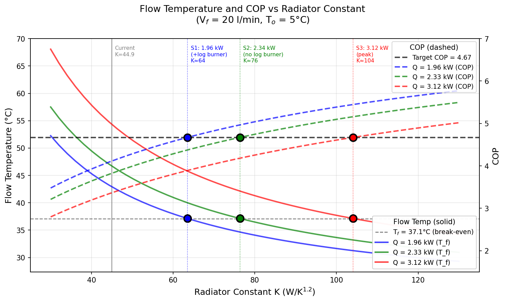

# A High Spark Gap Forces Radiator Upgrades in a Heat Pump Installation 

Motivated by the desire to transition away from heating with gas and reduce CO2 emissions I have been reading up on heat pumps and their installation. Various sources such as ["So You're Thinking About a Heat Pump: The UK Homeowner's Guide to Heat Pumps"](https://www.amazon.co.uk/Youre-Thinking-About-Heat-Pump/dp/B0GK7H511K/) or [The Ultimate Guide to Heat Pumps: Britain's best installers and experts tell you exactly what to watch for and what to ask](https://www.amazon.co.uk/Ultimate-Guide-Heat-Pumps-installers/dp/B0FNMNVC4Q) recommend radiator upgrades which do unfortunately increase installation costs. Initially, I hoped to avoid such an upgrade by using a heat pump in tandem with our log burner. In order to be able to make a more informed decision, however, I have carried out a simple analysis using steady-state thermal models. 

The outcome doesn't come as a surprise: the spark gap, the ratio of the unit price of electricity to that of gas, currently stands at about 4.67(^2); this directly sets the minimum Coefficient of Performance (COP) a heat pump must achieve to be cheaper to run than a gas boiler. Achieving that COP requires operating at sufficiently low flow temperatures, which in turn requires more radiator capacity than we currently have. The radiator upgrades are therefore a consequence of the high spark gap rather than an inherent requirement of heat pump technology; at present energy prices the motivation for switching remains decarbonisation rather than cost saving. Note that this story focuses on order-of-magnitude estimates rather than precise scientific calculations.

# Static Analysis and Heat Loss

The starting point of this analysis is the state of our property after the efforts detailed in [Improving the Thermal Performance of UK 1930s Semi Detached Houses](https://peter-wurmsdobler.medium.com/improving-the-thermal-performance-of-uk-1930s-semi-detached-houses-6f64c6514565). Therein the heat transfer model derived from first principles estimates the specific heat loss, or Heat Transfer Coefficient (HTC), to be **244 W/K**. In order to work out a representative heat loss of the building, I chose a cold winter month in Cambridge, UK: the bleak January 2026 with an average outdoor temperature T_o = 5°C; the indoor temperature was kept on average at T_i = 19°C (approximately 20°C downstairs, about 18°C upstairs). The resulting temperature difference is ΔT = 14K and yields a heat loss of Q_l = 244 × 14 = **3.42 kW**.

To validate this estimate, I looked up our energy consumption for January 2026: over that period electricity consumption was 263.75kWh (8.5kWh/day on average or 0.35kW continuous power), and gas utilisation was 1,924.91kWh (62.1 kWh/day on average or 2.59kW continuous power); the latter includes space heating and domestic hot water (DHC). It is assumed that energy for DHC stays mostly the same throughout the year and is solely responsible for the gas use in summer; for instance, in summer 2025 gas usage was about 12.5 kWh per day on average. In addition, we have been using a log burner as supplemental heat source, providing approximately 3 kW output for 3 hours daily which contributes 9 kWh/day as heat (0.375 kW average power). Over the heating period we are using about 1m^3 of locally sourced hard wood for £150, which results in about £1/day.

After subtracting the estimated DHC portion (12.5 kWh/day) from total gas consumption (62.1 kWh/day), the remaining 49.6 kWh/day of gas provides 47.12 kWh/day of actual heat to the radiators at 95% boiler efficiency(^1), i.e. 1.96 kW average power. Electricity consumed by appliances and eventually dissipated as heat will add about 0.3 kW as a heating equivalent. All combined, the total average heating power is 2.635 kW (radiators 1.96 kW + log burner 0.375 kW + appliances 0.3 kW), which is 77% of the estimated heat loss from the thermal model (3.42 kW). This discrepancy is a bit more than I expected but also reasonable, considering unaccounted solar gain and internal heat gains from occupants, as well as the fact that not all rooms are maintained at 19°C continuously (heating off from 10pm to 5am, and entrance hall more like 15°C) and we use thick curtains for the main entrance, french doors and windows. 

## Stationary Model of a House

The model used here assumes a simple lumped-mass representation of the house with the following parameters: internal temperature T_i, and outside temperature T_o; heat is supplied as Q_h at flow temperature T_f and return temperature T_r, then transferred to the internal thermal mass as Q_r through radiators; supplemental heat Q_b is provided by a log burner, and Q_a from appliances. The house loses heat as Q_l through the building fabric.

*Figure: Simple representation of a simple house model with heat sources and losses.*

The individual heat contributions can be written using heating fluid (water) density ρ and its specific thermal capacity c_p, the characteristic radiator constant K and radiative exponent n, the transfer coefficient h, and a flow rate V_f as:

Q_h = V_f * ρ * c_p * (T_f - T_r) 
Q_r = K * ((T_f + T_r)/2 - T_i)^n 
Q_l = h * (T_i - T_o)

In an equilibrium, or steady state, the heat balance for the radiator circuit (no losses in short pipework), is Q_h = Q_r, and for the room thermal balance, Q_l = Q_r + Q_b + Q_a; the balance in a steady state is invariant to the thermal mass. Overall, the radiator system must deliver:

Q_r = Q_l - Q_b - Q_a = h * (T_i - T_o) - Q_b - Q_a

This simplified model treats all radiators as a single unit, assuming uniform flow and return temperatures through a well-balanced system. The characteristic constant K represents the combined heat transfer capacity of all radiators, i.e. all their surfaces and types, plus the heating contribution from pipework distributed throughout the house. For the January 2026 conditions, the theoretical heat loss is Q_l = 3.42 kW, the log burner contributes Q_b = 0.375 kW (average), appliances contribute Q_a = 0.3 kW, giving a required radiator output of Q_r = 2.745 kW (theoretical). The radiator output obtained from the gas bill was Q_r = 1.96 kW, with total heat delivered of 2.635 kW.

## Empirical Validation

To validate the model, I used the operating conditions from January 2026 with an average radiator heating power of 1.96 kW on one hand. On the other, The installed radiators comprise single panel with single convector (Type 11) with dimensions 0.6×0.5 m, 1.0×0.5 m, 1.2×0.5 m, 0.5×0.6 m, and two 0.4×1.8 m panels totalling A = 3.14 m², and double panel with double convector (Type 22) with dimensions 0.6×0.5 m and 1.2×0.5 m totalling A = 0.9 m². Heat transfer coefficients based on typical radiator performance data are U ≈ 10 W/m²/K^1.2 for Type 11 radiators and U ≈ 15 W/m²/K^1.2 for Type 22 radiators. The resulting radiator constant K = 44.9 W/K^1.2.

Using the radiator equation Q_r = K × ΔT^1.2 and Q_r = 1.96 kW gives 1960 W = 44.9 W/K^1.2 × ΔT^1.2, i.e. ΔT required works out to be 23.3K. ΔT now depends on both the indoor temperature 19°C and the mean radiator temperature which depends on the flow rate and flow temperature; here we assume about 10 l/min which results in a mean radiator temperature of approximately 42.3°C (flow ~45°C, return ~40°C). I haven't got a temperature probe on the flow pipes, but the radiators "felt" very warm but not hot and it was bearable to touch them, which means the flow temperature is about 40ish °C. In addition, the boilers displayed a "boiler" temperature in the same range.

## Operating Constraints

With our empirically validated radiator constant (K = 44.9 W/K^1.2), we can now explore the fundamental relationship between flow rate and flow temperature for delivering heating power. Using constants for water as the working fluid (ρ = 1 kg/l and c_p = 4.18 kJ/kg/K), with the January 2026 average conditions (T_o = 5°C and T_i = 19°C), and radiator exponent n = 1.2, there are combinations of flow temperature T_f and flow rate V_f that can deliver the same heating power, shown as curves at constant power in the following plot. In other words, a heating controller can modulate either the flow temperature T_f or the flow rate V_f to achieve the same effect (if not sabotaged by Thermostatic Radaiator Valves, TRVs).

*Figure: Contour plot showing constant heating power curves. The 1.96 kW average radiator heating power is highlighted in red. This curve represents the operational constraint imposed by the current radiator capacity.*

For a given radiator constant K = 44.9 W/K^1.2, any target heating power defines a specific curve on this plot. The current radiators confine operation to the red 1.96 kW curve, which demonstrates the fundamental trade-off: low flow operation (~0.6 l/min) requires 66°C flow temperature with a large temperature drop to the return (ΔT ≈ 47K), whilst high flow operation (~20 l/min) requires only 43°C flow temperature with a small temperature drop to the return (ΔT ≈ 1.4K). At both extremes the mean radiator temperature is roughly the same (~42°C, determined by K and the heating load), but the higher flow rate achieves the target power with a much lower flow temperature which is what matters for the heat pump COP. 

# The Radiator Constant Impact

The contour plot shows that for a given radiator constant K and flow temperature the delivered heating power converges towards a constant with increasing flow rate; in other words, there is a limit to how much power can be delivered over existing radiators at a given flow temperature which is reached when the difference between radiator flow and return temperature goes to zero as the flow rate goes to infinity. Most pumps will struggle to reach that as fluid dynamics will affect resistance and pumping power is limited; so practically, we stay with a maximum flow rate below 20l/min, assumed for the remainder of this story. Then the heat delivered becomes a function of the flow temperature only, and so does the COP.

## Performance over Power

As already stated at the beginning, the spark gap is simply the ratio of the unit price of electricity to that of gas: at January 2026 prices, 27.69p/kWh divided by 5.93p/kWh gives 4.67(^2). For the heat pump to cost no more to run than the gas boiler it replaces, it must achieve a COP of at least 4.67; below that threshold, each unit of heat costs more to produce electrically than it would with gas. It is therefore perhaps revealing to show both the required flow temperature T_f and the achievable COP as a function of heat delivered, in our current setup (K = 44.9 W/K^1.2), bearing in mind that the heat pump needs to run at about 5°C above the radiator flow temperature since heat needs to be transferred from the internal heat pump circuit to the radiator circuit. Three scenarios detailed below demonstrate the issue.

*Figure: For the current radiator constant K = 44.9 W/K^1.2, the flow temperature (left axis, blue) and the expected COP (right axis, green) plotted over heat power delivered. The red dashed line shows break-even COP = 4.67. The three marked points show: 1.96 kW with log burner (COP = 4.11, below break-even), 2.34 kW without log burner (COP = 3.82, further below), and 3.12 kW at peak condition (COP = 3.36, well below).*

### Scenario 1 Heat Pump With Log Burner

If the gas boiler is replaced with a heat pump whilst continuing to use the log burner for supplemental heat, the heat balance remains with radiators delivering Q_r = 1.96 kW, log burner providing Q_b = 0.375 kW, appliances contributing Q_a = 0.3 kW, and total heat Q_l = 2.635 kW (including internal gains). High flow operation optimised for the heat pump at 20 l/min requires a flow temperature of 43°C with return temperature ~42°C (ΔT ≈ 1.4K), delivering 1.96 kW heating power. The estimated COP is 4.11 (at T_o=5°C, T_f=43°C), requiring electrical input of ~0.48 kW for daily electricity consumption of 11.4 kWh and daily electricity cost of £3.17 at 27.69p/kWh. Adding the log burner wood cost of £1.00/day gives a total daily cost of £4.17.

For comparison, gas for space heating (49.6 kWh/day at 5.93p/kWh) costs £2.94/day; including the log burner at £1.00/day brings the current total to £3.94/day. The heat pump scenario therefore costs £0.23/day more, approximately 6% more expensive than the current gas-plus-log-burner setup. The COP of 4.11 still falls below the spark gap of 4.67, indicating that at January 2026 energy prices the heat pump with log burner does not offer an economic advantage over gas, even though it would achieve fossil fuel independence for space heating. Conversely, it would only need a spark gap of 4.11 to start breaking even.

### Scenario 2 Heat Pump Without Log Burner

Without the log burner, the heat pump must provide the full heating requirement. Based on the heat balance equation (Q_r + Q_b + Q_a = Q_l), removing the log burner means that the total heat delivered Q_l = 1.96 + 0.375 + 0.3 = 2.635 kW (actual measured, including appliance gains) must now come from radiators and appliances, with Q_r = 2.335 kW required from the heat pump. 

Heat pump operation at maximum flow (20 l/min) requires a flow temperature of 47°C with return temperature ~45°C (ΔT ≈ 1.7K) to deliver 2.335 kW heating power. The estimated COP is 3.82 (at T_o=5°C, T_f=47°C), requiring electrical input of ~0.61 kW for daily electricity consumption of 14.7 kWh and daily cost of £4.06 at 27.69p/kWh. The operating cost is thus 3% higher than the current gas-plus-log-burner baseline (£3.94/day), and the COP of 3.82 falls below the break-even threshold of 4.67. Again, a spark gap below 3.82 would change the picture.

### Scenario 3 Heat Pump Without Log Burner at Peak Condition

The constraint is exacerbated during peak conditions. For a conservative design representing the theoretical full load during the coldest conditions, appliances contribute Q_a = 0.3 kW, leaving the heat pump to deliver 3.42 - 0.3 = 3.12 kW. At maximum flow (20 l/min), this requires a flow temperature of ~54°C with COP dropping to 3.36 and daily cost of £6.17 at 27.69p/kWh (22.3 kWh/day). This worst-case scenario underlines the case for radiator upgrades: attempting to deliver peak heating loads with insufficient radiator capacity requires operation at 54°C flow temperature, pushing the COP well below the break-even threshold of 4.67. Alternatively, a spark gap smaller than 3.36 would change the economics.

## Adjusting the Radiator Constant

At this point it is clear that, given the current spark gap of 4.67, the radiators need to be upgraded in order for the COP to exceed the break-even threshold, i.e. the constant K needs to be higher, but to what extent? To this end, let's work out the flow temperature and the expected COP plotted over a variable radiator constant K, but for various heating powers: the base load with log burner (1.96kW), one without log burner (2.335 kW) and the peak condition (3.12 kW). The intersection with the minimum COP to break even should reveal the required K for each case. (Note, heat pump temperature needs to be 5°C above the radiator flow temperature).

*Figure: For three heating power levels, the flow temperature (left axis, solid lines) and the expected COP (right axis, dashed lines) plotted over radiator constant K. The circles mark where COP reaches 4.67 (break-even threshold at January 2026 prices). To achieve break-even, K must be upgraded to 64 for 1.96 kW (blue, 1.4× current), to 76 for 2.34 kW (green, 1.7× current), and to 104 for 3.12 kW (red, 2.3× current). All break-even points converge to the same flow temperature of 37.1°C.*

At January 2026 energy prices, none of the three scenarios break even with the current K = 44.9. Because the required COP is set by the spark gap alone, all three break-even points converge to the same flow temperature of 37.1°C regardless of heating load; reaching that point requires progressively more radiator capacity as the heating load increases. For the 1.96 kW scenario with log burner, an upgrade to K ≈ 64 W/K^1.2 (1.4× current) is required. For the 2.335 kW scenario without log burner, K ≈ 76 W/K^1.2 (1.7× current) is needed. For the 3.12 kW peak condition, K ≈ 104 W/K^1.2 (2.3× current) is required, which can only be achieved by replacing most radiators with larger Type 22 or Type 33 panels and adding radiators in key rooms.

# Conclusion

The upgrades required at the current spark gap are substantial; replacing most radiators with larger panels and adding radiators in key rooms involves significant cost and disruption. At present the case for switching rests on decarbonisation rather than cost saving. Should energy pricing shift, however (e.g. a move away from merit order based marginal pricing, or adding energy transition costs to gas rather than onto the electricity cost), the required upgrades would become less severe. A spark gap below roughly 3.3 would bring the break-even flow temperature up high enough that no radiator upgrade would be needed at all, hence removing yet another impediment for heat-pump adoption.

# References

1. **Boiler efficiency:** The Viessmann Vitodens 222-F condensing gas boiler achieves 95% efficiency under typical operating conditions.

2. **Energy costs** as of January 2026, Ofgem energy price cap for a typical dual-fuel household paying by Direct Debit sets electricity at 27.69p per kWh with a 54.75p daily standing charge, and gas at 5.93p per kWh with a 35.09p daily standing charge. 

