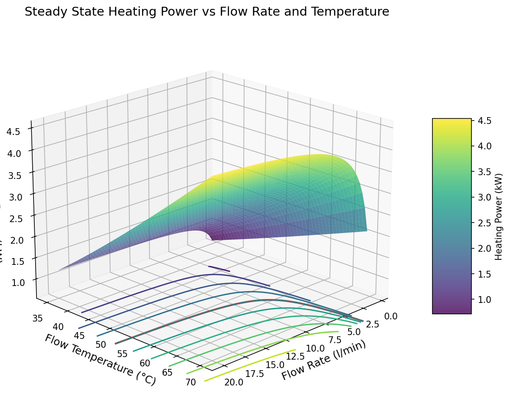
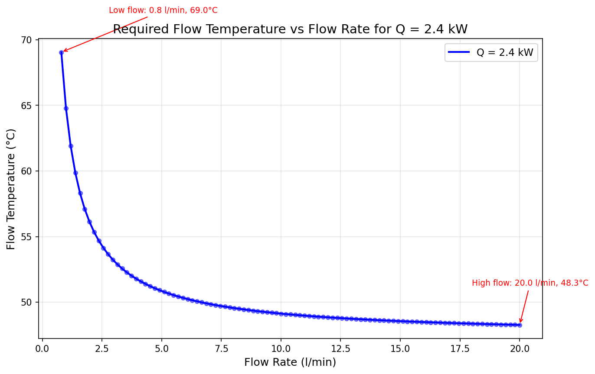

# Quantitative Analysis of Heat Pump Operation for Domestic Heating

This analysis examines heat pump operation for domestic heating, motivated by the desire to transition from fossil fuel heating and reduce CO2 emissions. Heat pumps require different operating strategies compared to gas boilers, as discussed in sources such as ["So You're Thinking About a Heat Pump: The UK Homeowner's Guide to Heat Pumps"](https://www.amazon.co.uk/Youre-Thinking-About-Heat-Pump/dp/B0GK7H511K/). The objective of this analysis is to demonstrate quantitatively how control and operation strategy impacts the economics of domestic heat pump heating. The approach focuses on order-of-magnitude understanding rather than comprehensive modelling or precise scientific calculation.

# Static Analysis and Heat Loss

The starting point of this analysis is the state of our property after [Improving the Thermal Performance of UK 1930s Semi Detached Houses](https://peter-wurmsdobler.medium.com/improving-the-thermal-performance-of-uk-1930s-semi-detached-houses-6f64c6514565): a specific heat loss, or Heat Transfer Coefficient (HTC), of **244 W/K**. Using the actual average conditions from January 2026 with outdoor temperature To = 5°C and indoor temperature Ti = 18°C (approximately 20°C downstairs, colder upstairs), the temperature difference ΔT = 13K gives a theoretical heat loss of Ql = 244 × 13 = **3.17 kW**.

To validate this theoretical value, I analysed our actual gas consumption for January 2026. Total gas consumption was 1,924.91 kWh for the month (62.1 kWh/day). Hot water usage for 3 showers daily (10 minutes each at 6 l/min) heating water from 5°C to 40°C requires approximately 7.3 kWh/day of heat, which at 90% boiler efficiency consumes 8.1 kWh/day of gas. A log burner providing approximately 3 kW output for 3 hours daily contributes 9 kWh/day supplemental heat.

After subtracting hot water consumption (8.1 kWh/day), the remaining 54.0 kWh/day of gas provides 48.6 kWh/day of actual heat to radiators at 90% boiler efficiency, equivalent to 2.0 kW average power. Combined with the log burner (0.375 kW average), the total average heating power is 2.4 kW. This measured value is 76% of the theoretical heat loss (3.17 kW), which is entirely reasonable considering thermal mass effects, internal heat gains from occupants and appliances, and the fact that not all rooms are maintained at 18°C continuously. 

## Stationary Model of a House

The model assumes a simple lumped-mass representation of the house with the following parameters: internal thermal capacity or mass `C`, insulated envelope with heat transfer coefficient `h`, internal temperature `Ti`, and outside temperature `To`. Heat is supplied as `Qh` through a flow rate `Vf` at flow temperature `Tf` and return temperature `Tr`. Heat is transferred to the internal thermal mass as `Qr` through radiators with a characteristic constant `K`. Supplemental heat `Qb` is provided by a log burner. The house loses heat as `Ql` through the building fabric.

DIAGRAM: simplified thermal model

In an equilibrium, or steady state as a stationary process, the heat balance is:

**Radiator circuit equilibrium:**
Qh = Vf * rho * cp * (Tf - Tr) = Qr = K * ((Tf + Tr)/2 - Ti)^n

**Room thermal balance:**
Qr + Qb = Ql = h * (Ti - To)

**Therefore, the radiator system must deliver:**
Qr = Ql - Qb = h * (Ti - To) - Qb

This simplified model treats all radiators as a single unit, assuming uniform flow and return temperatures throughout the system. The characteristic constant `K` represents the combined heat transfer capacity of all radiators plus the heating contribution from pipework distributed throughout the house. For the January 2026 conditions, the theoretical heat loss is Ql = 244 W/K × 13K = 3.17 kW, the log burner contributes Qb = 0.375 kW (average), giving a required radiator output of Qr = 2.8 kW (theoretical). The actual measured radiator output was Qr = 2.0 kW, with total heat delivered of 2.4 kW (76% of theoretical, accounting for thermal mass and internal gains).

## Empirical Validation

To validate the model, I used actual operating conditions from January 2026 with average radiator heating power of 2.0 kW, mean radiator temperature approximately 47.5°C (flow ~50°C, return ~45°C), indoor temperature 18°C, and temperature difference ΔT = 47.5 - 18 = 29.5K. The house radiators (see References) comprise Type 11 and Type 22 panels with total area 4.04 m² and calculated radiator constant from surface area of K = 35.9 W/K^n.

Using the radiator equation `Qr = K × ΔT^n` with n = 1.2 and Qr = 2.0 kW gives 2000 W = K × (29.5)^1.2 = K × 57.8, yielding an empirical K = 34.6 W/K^1.2. The empirical value (34.6) is about 4% lower than the calculated value from radiator area alone (35.9), which provides good validation of our model. The small difference could be due to measurement uncertainty in the observed temperatures or minor variations in actual radiator performance.

## Steady-State Operating Envelope

With our empirically validated radiator constant (K = 34.6 W/K^1.2), we can now explore the relationship between flow rate and flow temperature for delivering heating power. Using constants for water as the working fluid (ρ = 1 kg/l and cp = 4.18 kJ/kg/K), with the January 2026 average conditions (To = 5°C and Ti = 18°C), and radiator exponent n = 1.2, there are multiple combinations of flow temperature Tf and flow rate Vf that can deliver the same heating power.

*Figure 1: Three-dimensional plot showing heating power Q as a function of flow rate (Vf) and flow temperature (Tf). The red contour at the base shows the 2.0 kW average radiator heating requirement.*

*Figure 2: Contour plot with the 2.0 kW average radiator heating power highlighted in red. Multiple combinations of flow rate and temperature can deliver the same heating power.*

*Figure 3: Required flow temperature as a function of flow rate for delivering exactly 2.0 kW.*

The plots demonstrate that multiple combinations of flow rate and temperature can deliver the same heating power with significantly different operational characteristics. Low flow operation (~0.6 l/min) requires 70°C flow temperature with large temperature drop (ΔT ≈ 33K), whilst high flow operation (~20 l/min) requires only 48°C flow temperature with small temperature drop (ΔT ≈ 2K). At 48°C, a heat pump can achieve a Coefficient of Performance (COP) of approximately 3.0, whereas at 70°C the COP drops to around 2.3, demonstrating that operating at lower temperatures with higher flow rates provides approximately 30% higher efficiency.

## Comparative Analysis: Gas Boiler vs Heat Pump

To understand the practical implications of switching from a gas boiler to a heat pump, three scenarios are analysed based on the January 2026 measured performance:

### Scenario 1: Current Gas Boiler Operation (with Log Burner)

Under actual January 2026 conditions, the radiators deliver Qr = 2.0 kW average whilst the log burner provides Qb = 0.375 kW average (9 kWh/day), giving total heat Ql = 2.4 kW (including internal gains). The observed flow temperature is approximately 48°C with gas consumption for space heating of 54 kWh/day, resulting in a daily cost of £4.48 at 7p/kWh and 90% boiler efficiency.

The current system already operates at relatively high flow rates (~20 l/min), typical of modern condensing boilers with variable speed pumps, enabling the relatively low flow temperature of 48°C. With flow at 48°C and return at ~46°C, the mean water temperature is approximately 47°C. The radiator surface temperature is typically a few degrees cooler (around 40-42°C) due to heat transfer to air and thermal radiation, matching observed experience: radiators feel warm but are still comfortable to touch during typical January conditions, confirming the model predictions.

### Scenario 2: Heat Pump Replacing Gas Boiler (with Log Burner)

If the gas boiler is replaced with a heat pump whilst continuing to use the log burner for supplemental heat, the heat balance remains with radiators delivering Qr = 2.0 kW, log burner providing Qb = 0.375 kW, and total heat Ql = 2.4 kW (including internal gains). High flow operation optimised for the heat pump at 20 l/min requires a flow temperature of 48°C with return temperature ~46°C (ΔT ≈ 2K), delivering 2.0 kW heating power. The estimated COP is 3.0 (at To=5°C, Tf=48°C), requiring electrical input of ~0.67 kW for daily electricity consumption of 16 kWh and daily cost of £4.00 at 25p/kWh. With the log burner continuing to provide supplemental heat, the heat pump operates at 48°C with good COP and daily operating cost (£4.00) lower than gas (£4.48), making this economically viable whilst achieving independence from fossil fuels.

### Scenario 3: Heat Pump Without Log Burner

Without the log burner, the heat pump must provide the full heating requirement. Based on the heat balance equation (Qr + Qb = Ql), removing the log burner means the total heat delivered Ql = 2.0 + 0.375 = 2.4 kW (actual measured, including internal gains) must come entirely from radiators with Qr = 2.4 kW. This is 76% of the theoretical heat loss (3.17 kW), consistent with thermal mass effects and internal gains.

Heat pump operation at maximum flow (20 l/min) requires a flow temperature of 54°C with return temperature ~52°C (ΔT ≈ 2K) to deliver 2.4 kW heating power. The estimated COP is 2.8 (at To=5°C, Tf=54°C), requiring electrical input of ~0.86 kW for daily electricity consumption of 21 kWh and daily cost of £5.25 at 25p/kWh. The operating cost is thus 17% higher than the gas+log burner configuration (£4.48/day).

For a conservative design case representing the theoretical full load (3.17 kW) during coldest conditions, the flow temperature would be ~65°C with COP dropping to 2.5 and daily cost of £7.60. This worst-case scenario would apply only during the coldest periods without any thermal mass benefit.

## The Radiator Upgrade Conclusion

The analysis reveals important considerations for heat pump operation with current radiators having capacity K = 34.6 W/K^1.2. They can deliver 2.0 kW at 48°C with the log burner (COP ~3.0), 2.4 kW at 54°C without the log burner (COP ~2.8), but would need ~65°C to deliver the 3.17 kW theoretical peak load (COP ~2.5).

**Economic analysis:** With the log burner continuing, the heat pump cost (£4.00/day) is less than gas boiler cost (£4.48/day), achieving 11% cost saving whilst attaining fossil fuel independence at a flow temperature of 48°C (excellent for heat pump efficiency). Without the log burner at the actual measured load of 2.4 kW, the heat pump costs £5.25/day compared to £4.48/day for gas+log, representing 17% higher expense with flow temperature of 54°C (acceptable COP ~2.8). The worst-case theoretical scenario of 3.17 kW would cost £7.60/day, 70% more expensive than current gas+log burner setup with flow temperature ~65°C (lower COP ~2.5).

**Is a radiator upgrade necessary?** The requirement depends on the intended operating strategy. If continuing with the log burner, no upgrade is needed as current radiators are adequate at 48°C, the heat pump is economically attractive (11% cheaper than gas), and decarbonisation goals are achieved. If eliminating the log burner, a radiator upgrade is recommended as the current setup requires 54°C with moderate efficiency, whilst upgraded radiators would enable 45-48°C operation with COP improvement from 2.8 to 3.2, estimated annual savings of £150-250/year, and payback of 8-17 years on the upgrade cost.

For eliminating the log burner, the recommended radiator upgrade targets K value of 50-60 W/K^1.2 (approximately 1.5-1.7× current capacity), achieved by replacing existing radiators with larger Type 22 panels, adding additional radiators in key rooms, or upgrading to Type 33 (triple panel) in limited spaces. Benefits include delivering 2.4 kW at 45-47°C (COP ~3.2 vs 2.8), handling 3.17 kW theoretical peak at 50-55°C (COP ~2.9 vs 2.5), independence from supplemental heating sources, and daily cost reduction from £5.25 to £4.50 (£275/year saving). The estimated radiator upgrade cost of £2,000-4,000 with annual saving from improved COP of £150-275/year gives a payback of 8-17 years.

The current radiators are adequate for heat pump operation if the log burner continues to be used, with the system operating efficiently at 48°C. Complete independence from the log burner would benefit from a radiator upgrade to improve efficiency and reduce running costs, although the payback period of 8-17 years is moderately long.

# Dynamic Heating Requirements

[Future analysis: This section would explore time-varying heating demands, thermal mass effects, and optimized control strategies for minimizing energy consumption while maintaining comfort. The analysis would include temperature setback strategies, heat pump cycling, and the interaction between building thermal mass and heating system response time.] 

# References

**Radiator specifications:** The installed radiators comprise single panel with single convector (Type 11) with dimensions 0.6×0.5 m, 1.0×0.5 m, 1.2×0.5 m, 0.5×0.6 m, and two 0.4×1.8 m panels totalling A = 3.14 m², and double panel with double convector (Type 22) with dimensions 0.6×0.5 m and 1.2×0.5 m totalling A = 0.9 m². Total radiator area is 4.04 m². Heat transfer coefficients based on typical radiator performance data (validated against multiple sources including manufacturer specifications and Google Gemini) are U ≈ 8 W/m²/K^1.2 for Type 11 radiators and U ≈ 12 W/m²/K^1.2 for Type 22 radiators.

**Energy costs** as of January 2026: Natural gas at 7p/kWh and electricity assumed at 25p/kWh for heat pump analysis.

